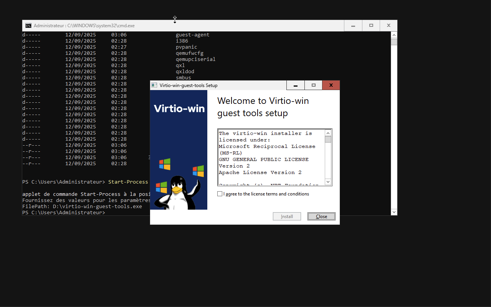
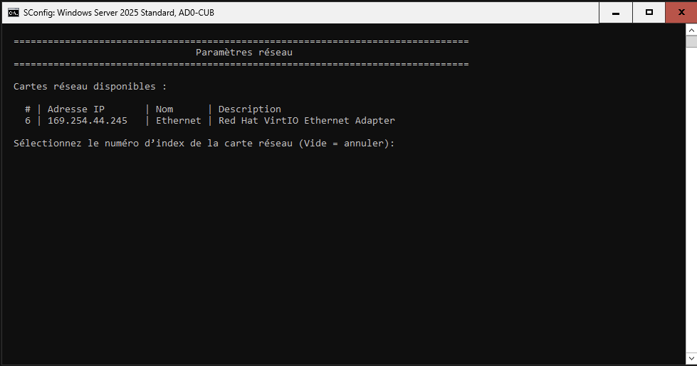
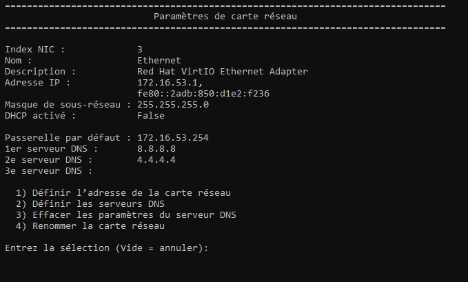
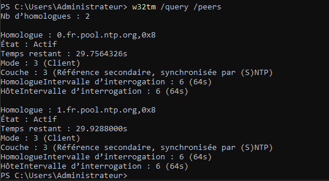
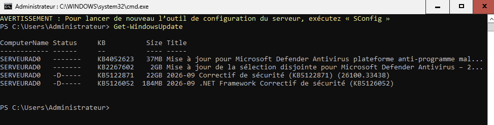

# Situation 1 : Préparation de la maquette et premiers paramétrages du serveur Windows 2025

{ width="150" }

> :bust_in_silhouette: **Fiche rédigée par** : GADONNAUD Ewen  
> :mortar_board: **Formation** : BTS SIO 2ème année - Option SISR  
> :school: **Établissement** : Lycée Paul-Louis Courier, Tours  
> :calendar: **Date** : Septembre 2026

---

## 0. Point information

Nous commençons par faire un point sur l'architecture voulue : deux AD, un WAC afin de contrôler via RDP les AD, le tout avec comme point d'entrée un **bastion** :


## 1. Création d'une VM

Ainsi, nous pouvons commencer à installer la VM AD sur la ferme de serveur Proxmox (172.16.99.18:8006). Pour s'y connecter, il faut sélectionner la connexion `adsio` et saisir ses identifiants d'AD.

Nous créons notre VM avec les caractéristiques suivantes :


## 2. Constat configuration IP après installation

Nous remarquons après installation que notre adresse IP est une adresse dite **APIPA**. Ces adresses sont attribuées par défaut lorsqu'une machine cliente est configurée pour recevoir des adresses via le protocole DHCP.

En l'occurrence, aucun serveur DHCP n'est présent dans notre réseau, et cette adresse lui a été attribuée.

## 3. Installation des drivers permettant la détection de la carte réseau à l'aide de commandes PowerShell

Après installation, il nous est demandé d'installer les **virtio guest tools** puis les drivers afin que notre carte réseau soit reconnue par Windows. Nous utilisons la commande suivante :

```powershell
Start-Process
FilePath: D:\virtio-win-guest-tools.exe
```



Ensuite, nous activons le démarrage automatique de l'agent Virtio au démarrage, puis nous le démarrons :

```powershell
Set-Service -Name "QEMU-GA" -StartupType Automatic # Démarrage automatique
Start-Service QEMU-GA # Lancement du service
```

## 4. Vérification de la détection de la carte réseau

Retournons maintenant dans l'utilitaire **SConfig** afin de vérifier si la carte réseau a bien été détectée :



Notre carte réseau est bien trouvée à l'index 6. Nous configurons maintenant les paramètres réseaux de notre AD comme ceci :

* Adresse IP : `192.168.3.1` (pour l'étudiant 1 du groupe)
* Masque de sous-réseau : `255.255.255.128` (/25)
* Passerelle par défaut : `192.168.1.126`
* DNS : `8.8.8.8` et `4.4.4.4`

> En attendant, nous configurons notre serveur avec l'IP `172.16.53.1` et `255.255.255.0` en masque puis `172.16.53.254` en passerelle afin d'avoir un accès à internet, car notre infrastructure n'est pas encore établie.



## 5. Changement du nom du serveur

Afin de changer le nom du serveur, nous pouvons utiliser l'utilitaire **SConfig**, dans l'onglet numéro 2.

Ou sinon, à l'aide de la commande PowerShell suivante :

```powershell
Rename-Computer -NewName "SERVEURAD0" -Restart
```

Ici, nous définissons un nouveau nom, puis nous redémarrons le serveur dans la même commande avec l'option `-Restart`.

## 6. Vérification de la mise en place des recommandations de l'ANSSI pour sécuriser notre serveur

### 6.1. Vérifier la synchronisation horaire

#### 6.1.1. Vérifier si un serveur de temps "NTP" est actuellement utilisé par votre serveur Windows

Un serveur NTP de Microsoft était actuellement utilisé par le serveur. Il nous faut donc le changer.

#### 6.1.2. Modifier le serveur de temps pour prendre en compte "0.fr.pool.ntp.org" et "1.fr.pool.ntp.org" et forcer une première synchronisation

Nous synchronisons l'horloge interne de notre serveur avec le serveur NTP présent à l'adresse `0.fr.pool.ntp.org` avec la commande suivante :

```powershell
w32tm /config /manualpeerlist:"0.fr.pool.ntp.org,0x8 1.fr.pool.ntp.org,0x8" /syncfromflags:manual /reliable:yes /update
```

- **`,0x8`** après chaque serveur : c'est le flag qui force le mode client NTP standard (SpecialPollInterval + UseAsFallbackOnly désactivé). Sans ce flag, Windows peut traiter l'entrée différemment et le comportement de bascule ne fonctionne pas comme attendu.
- **Le failover est natif** : Windows interroge tous les serveurs de la liste et bascule automatiquement sur le suivant si le premier ne répond pas.
- **`/reliable:yes`** : pertinent uniquement si ce serveur agit lui-même comme source de temps fiable pour d'autres machines du domaine (ex : le contrôleur de domaine PDC emulator).
- **`/update`** : permet la synchronisation immédiate des serveurs.

Nous pouvons utiliser la commande suivante afin de vérifier si la configuration a bien été prise en compte :

```powershell
w32tm /query /peers
```



Les deux serveurs sont actifs et interrogés en conséquence.

### 6.2. Vérifier que les fonctionnalités de sécurité natives sont activées

#### 6.2.1. Vérifier l'activation de l'UAC

À présent, nous vérifions si l'**UAC** (User Account Control) et le **Pare-feu Windows Defender** sont actifs, en accord avec la réglementation de l'ANSSI. Commande pour récupérer les informations concernant l'UAC :

```powershell
Get-ItemProperty -Path "HKLM:\SOFTWARE\Microsoft\Windows\CurrentVersion\Policies\System" -Name "EnableLUA"
```

Qui nous renvoie la sortie suivante :

```powershell
PS C:\Users\Administrateur> Get-ItemProperty -Path "HKLM:\SOFTWARE\Microsoft\Windows\CurrentVersion\Policies\System" -Name "EnableLUA"

EnableLUA : 1
PSPath : Microsoft.PowerShell.Core\Registry::HKEY_LOCAL_MACHINE\SOFTWARE\Microsoft\Windows\CurrentVersion\Policies\System
PSParentPath : Microsoft.PowerShell.Core\Registry::HKEY_LOCAL_MACHINE\SOFTWARE\Microsoft\Windows\CurrentVersion\Policies
PSChildName : System
PSDrive : HKLM
PSProvider : Microsoft.PowerShell.Core\Registry

PS C:\Users\Administrateur>
```

Grâce au champ `EnableLUA : 1`, nous pouvons en conclure que l'UAC est bien activé.

#### 6.2.2. Vérifier l'activation du pare-feu Windows Defender

Nous vérifions ensuite le second volet de cette exigence de sécurité, à savoir l'état du pare-feu Windows Defender sur les trois profils réseau :

```powershell
Get-NetFirewallProfile | Select-Object Name, Enabled
```

Qui nous renvoie la sortie suivante :

| Name    | Enabled |
| ------- | ------- |
| Domain  | True    |
| Private | True    |
| Public  | True    |

Le pare-feu est donc bien actif sur tous les profils réseaux.

### 6.3. Mettre à jour le serveur

#### 6.3.1. Installer le module "WindowsUpdate" pour les mises à jour

Afin d'installer le module WindowsUpdate, nous utilisons la commande PowerShell suivante :

```powershell
Install-Module -Name PSWindowsUpdate -Force
```

Il nous sera demandé si nous souhaitons installer le fournisseur de modules externes "NuGet". Nous appuyons sur O (Oui).

#### 6.3.2. Vérifier les mises à jour disponibles

Afin de vérifier les mises à jour disponibles, nous devons activer le service Windows Update avec la commande suivante :

```powershell
Start-Service wuauserv
Set-Service -Name wuauserv -StartupType Automatic
```

La commande `Set-Service` permet le démarrage automatique du service au lancement du serveur.

Nous vérifions ensuite les mises à jour disponibles avec la commande suivante :

```powershell
Get-WindowsUpdate
```

Nous obtenons la liste de tous les correctifs à ce jour installables (au total, environ 24 Go de mises à jour) :



#### 6.3.3. Installer les mises à jour proposées

Pour installer les mises à jour proposées, nous utilisons la commande suivante :

```powershell
Get-WindowsUpdate -Install -AcceptAll -AutoReboot
```

Les arguments expliqués :

* **`-Install`** : installation des mises à jour
* **`-AcceptAll`** : sélection de toutes les mises à jour proposées
* **`-AutoReboot`** : redémarrage automatique du serveur à la fin des mises à jour (recommandé)

### 6.4. Sécuriser le compte "Administrateur local" du serveur Windows

#### 6.4.1. Vérifier le SID (Security Identifier) du compte "Administrateur local" actuel

Nous pouvons vérifier le SID de notre compte Administrateur avec la commande PowerShell suivante :

```powershell
Get-LocalUser -Name "Administrateur" | Select-Object Name, SID
```

Nous obtenons un tableau avec la correspondance entre le compte Administrateur et son SID :

| Name           | SID                                           |
| -------------- | --------------------------------------------- |
| Administrateur | S-1-5-21-1197048702-1364765968-4293633712-500 |

#### 6.4.2. Renommer le compte "Administrateur" en "ADM-SRV-00" pour le serveur AD0 et vérifier si son SID est modifié

Afin de renommer notre compte, nous utilisons la commande PowerShell suivante :

```powershell
Rename-LocalUser -Name "Administrateur" -NewName "ADM-SRV-00"
```

Maintenant, vérifions le SID avec la commande utilisée précédemment, adaptée comme ceci :

```powershell
Get-LocalUser -Name "ADM-SRV-00" | Select-Object Name, SID
```

| Name       | SID                                           |
| ---------- | --------------------------------------------- |
| ADM-SRV-00 | S-1-5-21-1197048702-1364765968-4293633712-500 |

Nous remarquons que son SID n'a pas changé.

#### 6.4.3. Modifier le mot de passe du compte Administrateur afin qu'il respecte les recommandations de l'ANSSI

Nous utilisons depuis le départ de la situation un mot de passe robuste (pass phrase) qui respecte les recommandations de l'ANSSI. Tout de même, voici les commandes permettant de changer le mot de passe du compte ADM-SRV-00 :

```powershell
Set-LocalUser -Name "ADM-SRV-00" -Password (ConvertTo-SecureString "NouveauMotDePasse" -AsPlainText -Force)
```

## Annexe : Mise en place de l'accès distant en SSH

Afin de pouvoir administrer le serveur à distance depuis notre poste de travail sans dépendre systématiquement de la console Proxmox, nous installons et configurons le service **OpenSSH Server**, natif à Windows Server depuis les versions récentes.

### Installation du service OpenSSH Server

Nous vérifions d'abord si la fonctionnalité est déjà présente sur le système :

```powershell
Get-WindowsCapability -Online | Where-Object Name -like 'OpenSSH*'
```

N'étant pas installée par défaut, nous l'ajoutons avec la commande suivante :

```powershell
Add-WindowsCapability -Online -Name OpenSSH.Server~~~~0.0.1.0
```

### Démarrage du service

Une fois installé, le service `sshd` n'est pas démarré. Nous corrigeons cela :

```powershell
Start-Service sshd
```

> À noter ! Ici, nous utilisons SSH seulement pour la facilité d'entrer des commandes dans le terminal directement sur notre machine cliente, à des fins de praticité. Il sera ensuite désactivé et les règles de pare-feu rétablies comme par défaut à la fin de notre situation.

### Configuration de la règle de pare-feu

L'installation d'OpenSSH Server crée normalement une règle de pare-feu automatiquement (`OpenSSH-Server-In-TCP`), autorisant le trafic entrant sur le port TCP 22. Nous vérifions sa présence :

```powershell
Get-NetFirewallRule -DisplayName "OpenSSH*"
```

Si cette règle est absente ou désactivée, nous la créons manuellement :

```powershell
New-NetFirewallRule -DisplayName "Autoriser SSH" -Direction Inbound -Protocol TCP -LocalPort 22 -Action Allow
```

### Test de connexion depuis le poste client

Depuis notre machine, nous testons la connexion SSH vers le serveur :

```bash
ssh Administrateur@172.16.53.1
```

> **Point de vigilance** : si le serveur a été réinstallé ou que son IP a été précédemment attribuée à une autre machine, un message d'avertissement `WARNING: REMOTE HOST IDENTIFICATION HAS CHANGED!` peut apparaître. Cela signifie que l'empreinte de la clé d'hôte SSH ne correspond plus à celle enregistrée localement. Dans un contexte de lab où l'on sait que le serveur a été réinstallé, on supprime l'ancienne entrée en toute sécurité :
>
> ```bash
> ssh-keygen -R 172.16.53.1
> ```
>
> Dans un contexte de production, cette empreinte devrait toujours être comparée avec celle générée réellement par le serveur avant suppression, afin d'écarter tout risque d'attaque de type Man-in-the-Middle.

La connexion établie, nous disposons désormais d'un accès distant sécurisé au serveur, sans dépendre de la console graphique Proxmox pour les opérations d'administration courantes.
