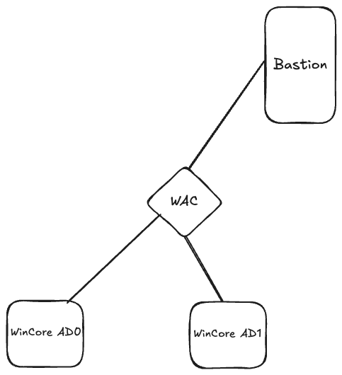
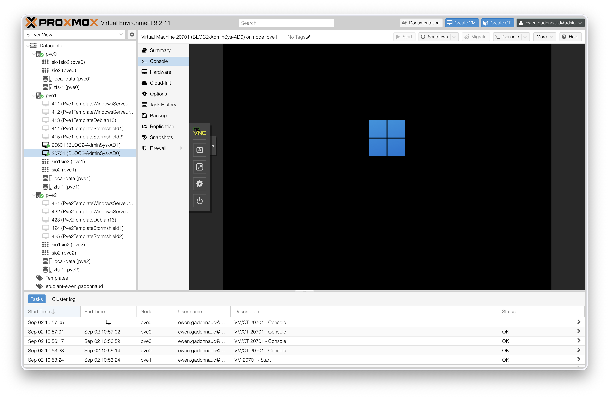

# Situation 1 : Préparation de la maquette et premiers paramétrages du serveur Windows 2025

> :bust_in_silhouette: **Fiche rédigée par** : GADONNAUD Ewen  
> :mortar_board: **Formation** : BTS SIO 2ème année - Option SISR  
> :school: **Établissement** : Lycée Paul-Louis Courier, Tours  
> :calendar: **Date** : Septembre 2026

---

Nous commençons par faire un point sur l'architecture voulue, deux AD, un WAC afin de contrôler via RDP les AD, le tout avec comme point d'entrée un bastion :

Ainsi, nous pouvons commencer à installer la VM AD sur la ferme de serveur Proxmox (172.16.99.18:8006). Pour s'y connecter, il faut sélectionner la connexion `adsio` et saisir ses identifiants d'AD.

Nous créons notre VM avec les caractéristiques suivantes :

