# Situation 2 : Installation d'un centre d'administration des serveurs Windows (WAC - Windows Admin Center)

{ width="150" }

> :bust_in_silhouette: **Fiche rédigée par** : GADONNAUD Ewen  
> :mortar_board: **Formation** : BTS SIO 2ème année - Option SISR  
> :school: **Établissement** : Lycée Paul-Louis Courier, Tours  
> :calendar: **Date** : Septembre 2026


---

## Partie 1 - Installation du serveur Windows 2025 avec bureau pour WAC

## 1. Création d'une VM Windows Server 2025 avec bureau

Afin de créer la VM Windows Server 2025, nous utiliserons la template prévue à cet effet présente sur Proxmox (`Pve1TemplateWindowsServeur2025`) en adaptant les informations suivantes :

* **ID** : 20701 (2 = SIO2 / 07 = étudiant07 / 01 = VM1)
* **Nom de la VM** : `BLOC2-AdminSys-WAC0`
* **IP** : `192.168.3.5/25`
* **Passerelle** : `192.168.3.126`

## 2. Réaliser un « sysprep » de votre serveur pour réinitialiser les SID

Afin d'utiliser sysprep, nous faisons la combinaison **Win+R** et entrons `sysprep` pour se rendre dans le répertoire contenant ce dernier. Nous choisissons les options suivantes :

* **Mode OOBE** : nettoyage du système, remise en état d'usine « propre »
* **Généraliser** : c'est cette option qui va venir réaffecter les SID proprement et aléatoirement
* **Redémarrer** : redémarrage du système après le sysprep

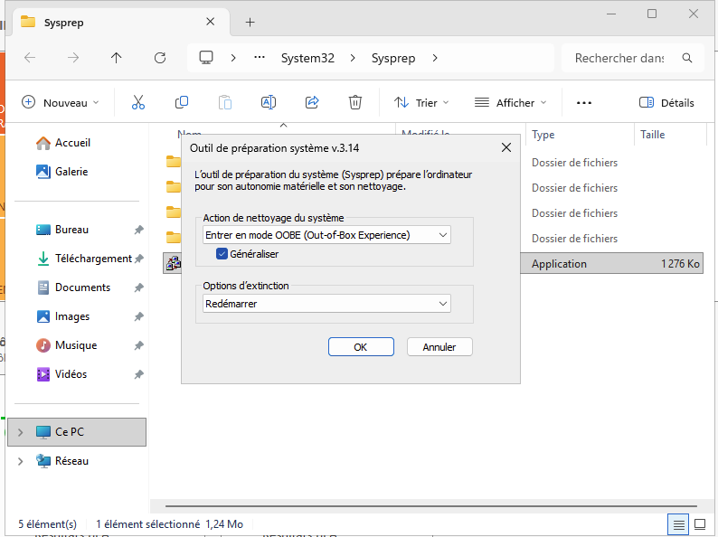 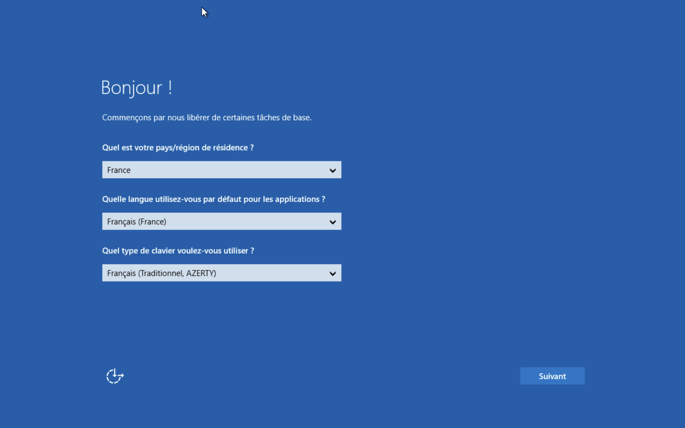

## 3. Modifier et vérifier la configuration IP de votre VM

Configuration IP appliquée à la VM (agence de Hongkong, étudiant 1), vérifiée avec la commande `ipconfig` :

| Paramètre | Valeur |
|---|---|
| Adresse IPv4 | 192.168.3.5 |
| Masque de sous-réseau | 255.255.255.128 (/25) |
| Passerelle par défaut | 192.168.3.126 |

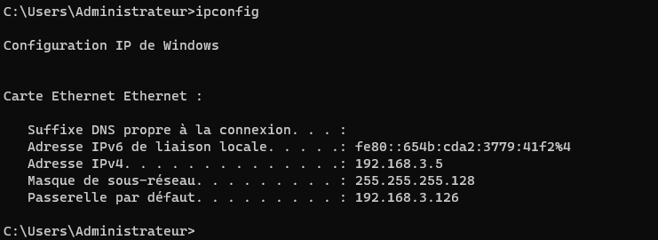

## 4. Réaliser les modifications de base du système

### 4.1. Mettre à jour le système

Les mises à jour sont lancées depuis **Windows Update**. La capture montre les mises à jour en cours de téléchargement (Microsoft Defender Antivirus, correctif de sécurité .NET Framework, correctif de sécurité cumulatif 2026-09, outil de suppression de logiciels malveillants).

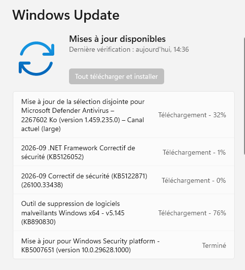

### 4.2. Modifier le nom du serveur

Le serveur est renommé **SERVEURWAC0** (nom visible ensuite dans WAC, voir [6. Ajouter les serveurs Windows dans WAC](#6-ajouter-les-serveurs-windows-dans-wac)).

### 4.3. Modifier le nom de l'utilisateur « Administrateur » local par « ADM-SRV-WAC » et définir un mot de passe conforme ANSSI

Le compte local est renommé en **ADM-SRV-WAC0** avec `Rename-LocalUser`, puis son mot de passe est défini avec `Set-LocalUser`.

```powershell
Rename-LocalUser -Name "<ancien nom>" -NewName "ADM-SRV-WAC0"
Set-LocalUser -Name "ADM-SRV-WAC0" -Password (ConvertTo-SecureString "<mot de passe>" -AsPlainText -Force)
```

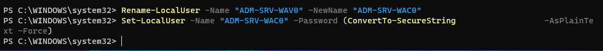

**Référentiel utilisé** : guide ANSSI *Recommandations relatives à l'authentification multifacteur et aux mots de passe* (ANSSI-PG-078, version 2.0 du 08/10/2021). Points retenus :

* La longueur prime sur la complexité. Longueurs minimales indicatives (jeu de 90 caractères) : 9 à 11 caractères pour une sensibilité faible à moyenne (≈ 65 bits), 12 à 14 pour moyen à fort (≈ 85 bits), **au moins 15 pour fort à très fort (≥ 100 bits)**, avec authentification multifacteur recommandée dans ce dernier cas (R21).
* Pas de longueur maximale imposée, afin de permettre les phrases de passe (R22).
* Pour un compte à privilèges, un délai d'expiration de 1 à 3 ans est recommandé (R25).
* Les mots de passe par défaut doivent être modifiés (R38).

### 4.4. Modifier le serveur de temps et forcer une première synchronisation

Les sources de temps sont les mêmes que celles des autres serveurs Windows : `0.fr.pool.ntp.org` et `1.fr.pool.ntp.org`.

```powershell
w32tm /config /manualpeerlist:"0.fr.pool.ntp.org,0x8 1.fr.pool.ntp.org,0x8" /syncfromflags:manual /reliable:yes /update
w32tm /query /peers
```

* `/manualpeerlist` : liste des serveurs NTP. Le flag `0x8` force l'envoi de requêtes en mode client.
* `/syncfromflags:manual` : le serveur se synchronise sur la liste manuelle et non sur la hiérarchie de domaine.
* `/update` : applique immédiatement la configuration.
* `w32tm /query /peers` : la sortie confirme **2 homologues actifs**, en mode 3 (Client), de couche 2 (synchronisés par NTP).

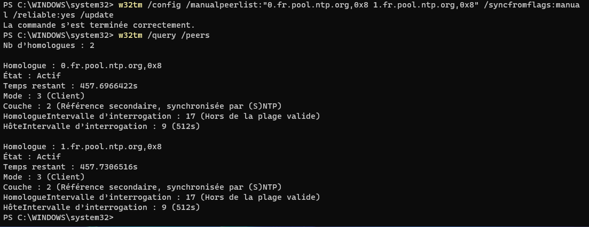

---

## Partie 2 - Installation de Windows Admin Center (WAC)

## 5. Suivre la procédure - Fiche de procédure 2 : WAC - Windows Admin Center

### 5.1. Lancement de l'installeur

Le programme d'installation vérifie la version de l'OS, le réseau et le pare-feu, l'espace disque, puis télécharge la dernière version de WAC.

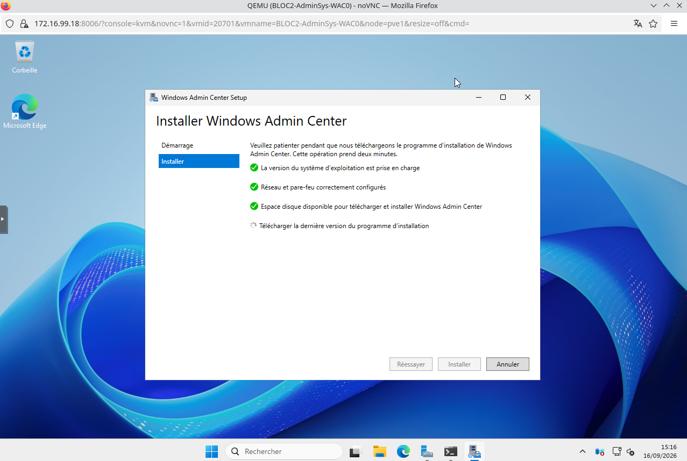

### 5.2. Accès réseau

Deux modes possibles : **localhost uniquement**, ou **accès à distance** via le nom de machine ou le nom de domaine complet. L'accès à distance est nécessaire ici : WAC est ensuite atteint depuis un autre poste (voir 5.11).

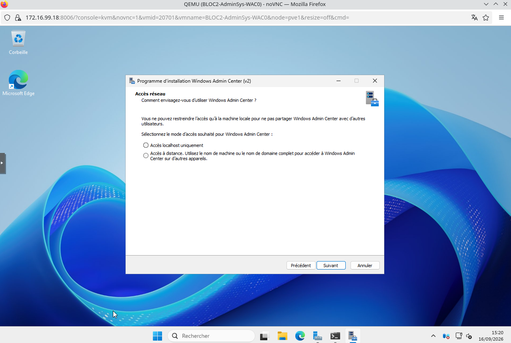

### 5.3. Authentification et autorisation de connexion

Option retenue : **connexion au formulaire HTML** (identifiants saisis dans le navigateur). L'autre option, l'authentification Windows (NTLM ou Kerberos), n'a pas été retenue.

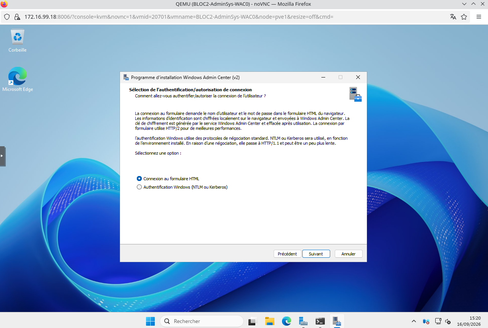

### 5.4. Numéro de port

Port HTTPS externe : **10443**. L'installeur crée les règles de pare-feu correspondantes et réserve la plage 6601-6610 pour la communication interne.


### 5.5. Certificat TLS

Option retenue : **certificat auto-signé**, expirant au bout de 60 jours. L'installeur précise qu'il est prévu pour les tests, un certificat officiel étant attendu en production.


### 5.6. Nom de domaine complet

FQDN saisi : `wac0.local.californie.cub.sioplc.fr`. Il doit correspondre au nom du sujet du certificat TLS.

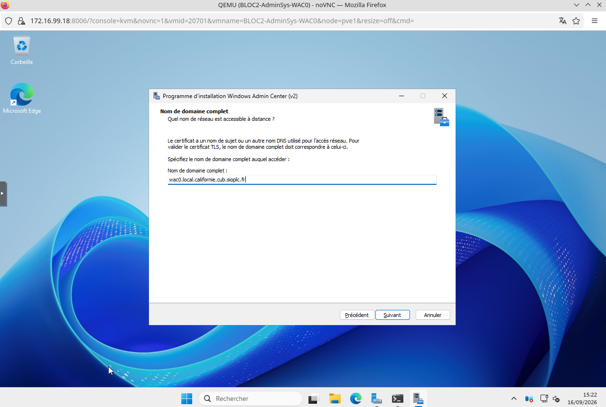

### 5.7. Hôtes approuvés

Option retenue : **autoriser l'accès à n'importe quel ordinateur** (paramètre WinRM des hôtes approuvés, concernant les machines non jointes à un domaine).


### 5.8. WinRM sur HTTPS

Option retenue : **HTTP, mécanisme par défaut**. L'installeur indique que la communication WinRM n'est alors pas chiffrée. WinRM sur HTTPS nécessiterait un certificat TLS préconfiguré sur chaque machine cible.


### 5.9. Mises à jour automatiques

Option retenue : **installer les mises à jour automatiquement (recommandé)**.


### 5.10. Vérification des services

Après l'installation, `Get-Service` montre les deux services WAC à l'état **Stopped**. Ils sont démarrés avec `Start-Service WindowsAdminCenter`, puis `Get-Service` confirme l'état **Running**.

```powershell
Get-Service *AdminCenter*,*ServerManagement*
Start-Service WindowsAdminCenter
```

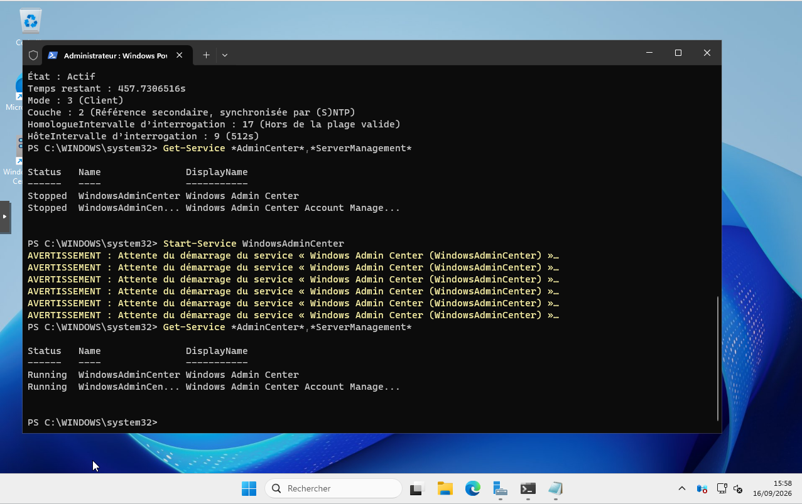

### 5.11. Premier accès à l'interface

Accès depuis un autre poste à `https://192.168.3.5:10443`. La page indique la collecte d'informations sur l'environnement.

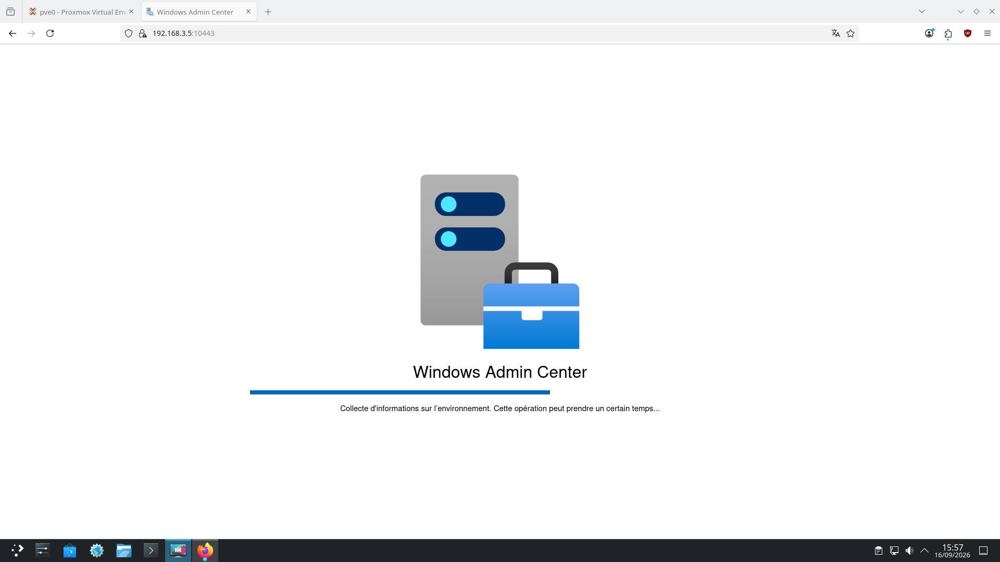

### 5.12. Interface WAC

Accès via le FQDN `https://wac0.local.californie.cub.sioplc.fr:10443`. Le navigateur affiche « Non sécurisé » car le certificat est auto-signé. La passerelle **serveurwac0** est listée, gérée avec le compte `SERVEURWAC0\ADM-SRV-WAC0`.

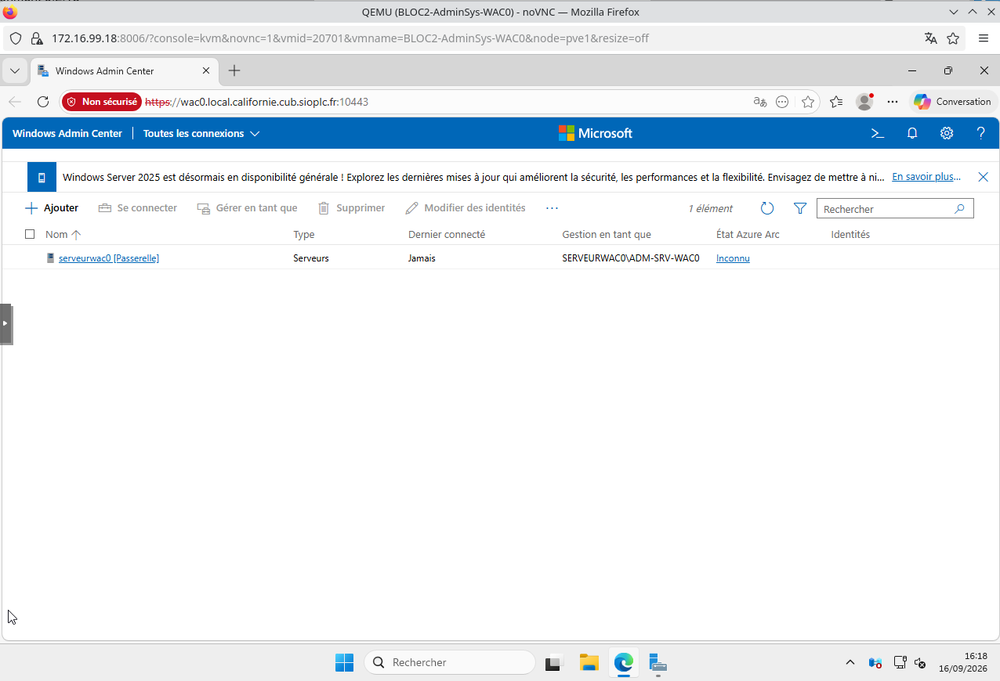

## 6. Ajouter les serveurs Windows dans WAC

Serveurs ajoutés dans WAC (adresses de l'énoncé : 192.168.3.1 à 3.4) :

| Serveur      | Adresse     |
| ------------ | ----------- |
| ServeurAD0   | 192.168.3.1 |
| ServeurAD1   | 192.168.3.2 |
| ServeurDHCP0 | 192.168.3.3 |
| ServeurDHCP1 | 192.168.3.4 |

WAC liste bien 5 éléments : les 4 serveurs et la passerelle serveurwac0. Ils sont gérés avec le compte `ADM-SRV-00`.

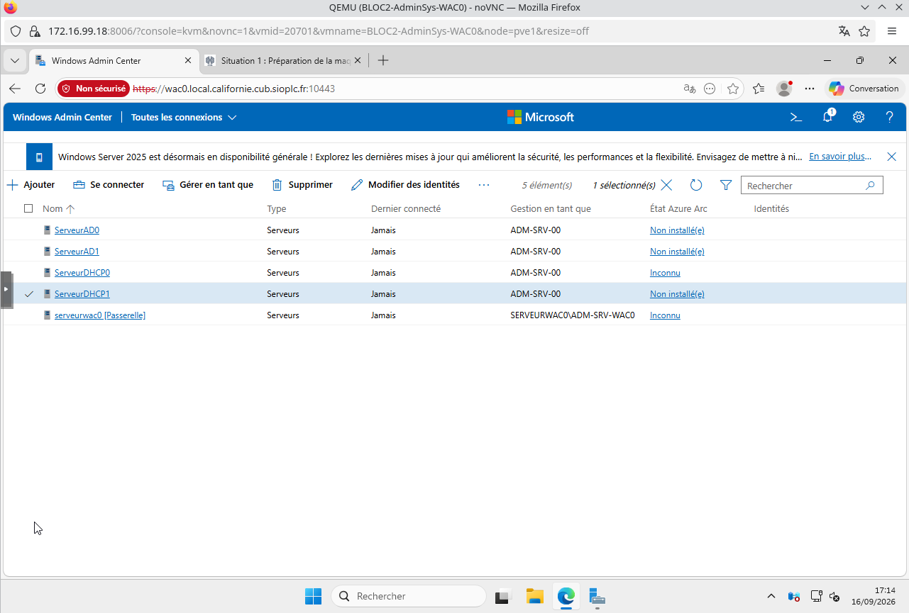

## 7. Créer un compte « administrateurWAC0 » pour administrer le WAC

Le compte est créé en PowerShell : le mot de passe est saisi via `Read-Host -AsSecureString` (il n'apparaît pas en clair), puis `New-LocalUser` crée le compte, qui est ajouté au groupe local **Utilisateurs**.

```powershell
$MotDePasse = Read-Host "<invite>" -AsSecureString
New-LocalUser -Name "administrateurWAC0" -Password $MotDePasse
Add-LocalGroupMember -Group "Utilisateurs" -Member "administrateurWAC0"
```

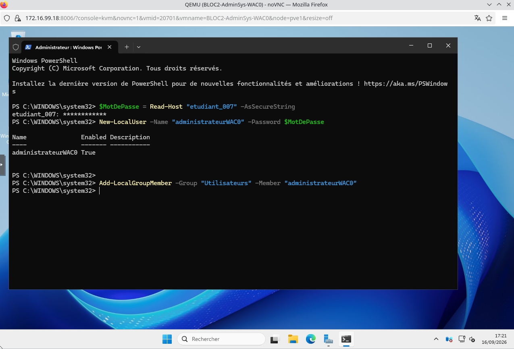

!!! info "Rôle obtenu dans WAC"
    D'après la documentation Microsoft, en l'absence de domaine l'accès à la passerelle WAC est contrôlé par les groupes locaux **Utilisateurs** (rôle *gateway user*) et **Administrateurs** (rôle *gateway administrator*). Seuls les administrateurs locaux de la passerelle sont *gateway administrators*.

---

## Sources

* ANSSI, *Recommandations relatives à l'authentification multifacteur et aux mots de passe*, ANSSI-PG-078 v2.0, 08/10/2021 : <https://messervices.cyber.gouv.fr/documents-guides/anssi-guide-authentification_multifacteur_et_mots_de_passe.pdf>
* Microsoft Learn, *Configure user access control and permissions* (Windows Admin Center) : <https://learn.microsoft.com/en-us/windows-server/manage/windows-admin-center/configure/user-access-control>
* Microsoft Learn, *User access options with Windows Admin Center* : <https://learn.microsoft.com/en-us/windows-server/manage/windows-admin-center/plan/user-access-options>
* Meinberg KB, *Configuring w32time as NTP client* (flag `0x8`) : <https://kb.meinbergglobal.com/kb/time_sync/timekeeping_on_windows/configuring_w32time_as_ntp_client>