# Situation 3 : Gestion des versions avec Git et Github

{ width="150" }

> :bust_in_silhouette: **Fiche rédigée par** : GADONNAUD Ewen  
> :mortar_board: **Formation** : BTS SIO 2ème année - Option SISR  
> :school: **Établissement** : Lycée Paul-Louis Courier, Tours  
> :calendar: **Date** : Septembre 2026

---

## Partie 1 - Installation et configuration de Git

### 1. Installer la version windows de Git sur le poste ou serveur d'administration

Ici, Git et toute la situation se dérouleras sur le serveur WAC0 d'administration.

Nous installons git sur l'URL suivante : https://git-scm.com/install/windows

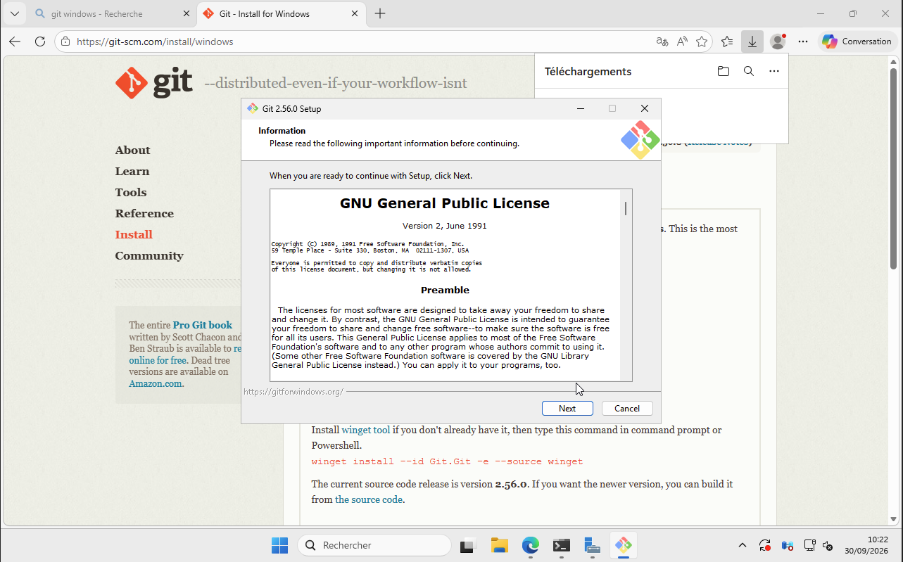

Maintenant, vérifions que Git Bash, Git GUI et Git CMD soient installés : 

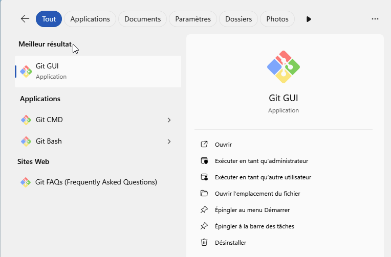

La version de Git actuellement installée est la version 2.56.0.windows.1

Git est utilisé afin de pouvoir versionner du code, des fichiers et autres types de documents. Le versionnage consiste à prendre une sorte d'instantané à un moment X de notre fichier versionné et pouvoir revenir en arrière vers d'autres versions de notre code quand nous le souhaitons. Il est aussi utilisé dans le travail collaboratif, notamment à l'aide des PRs (Pull Request) et des branches. 

### 2. Vérifier puis configurer l'identité utilisée par Git : 

Nous utilisons les commandes suivantes afin de configurer notre identité utilisée par Git : 

```shell
$ git config --global user.name "Ewen Gadonnaud"
$ git config --global user.email "eweng.pro@gmail.com"
$ git config --global --list

user.name=Ewen Gadonnaud
user.email=eweng.pro@gmail.com
```

Git associe-t-il un nom et une adresse électronique aux commits afin de pouvoir assurer une traçabilité concrète et d'y permettre une identification quant à qui à fait quoi et quand lors de changements des versions d'un fichier ou autre dans un dépôt Git. 

C'est pour quoi il est nécessaire de configurer son identité au préalable.

## Partie 2 - Création d'un premier dépôt Git

Après création du script "diagnostic-reseau.ps1" contenant ce bout de code : 

```powershell
Write-Host "Diagnostic réseau CUB"
hostname
Get-Date
Get-NetIPConfiguration
```

Nous initialisons depuis Git Bash, en se plaçant dans le répertoire ou se trouve notre bout de code, à l'aide des commandes suivantes :

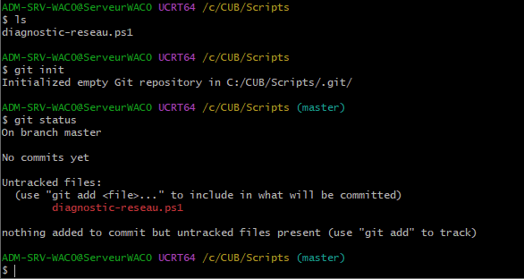

L'initialisation d'un dépôt Git constitue notre base de code ou fichiers qui sera versionné dans le futur, il contiendra tout nos commits, nos branches, et nos PRs.

La commande "git status" nous permets de savoir si des commits ont été effectués sur le dépôts, de savoir sur quelle branche de développement nous nous situons et des éventuels fichiers résiduels non ajoutés en commit et qui ne sons pas encore suivis par Git.

## Partie 3 - Création des permières versions du script

Nous ajoutons notre fichier au suivi de Git avec la commande suivante :

```shell
git add diagnostic-reseau.ps1
```

Notre commande "git status nous renvoie la sortie suivante" : 

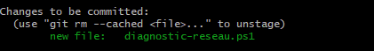

en nous expliquant que le fichier "diagnostic-reseau.ps1" est bien ajouté en phase de transition pré commit, mais qu'il reste à faire le commit.

Nous créons alors notre premier commit commenté avec la commande suivante : 

```shell
git commit -m "Création du script de diagnostic réseau" 

# Ici le paramètre -m corresponds à l'ajout d'un commentaire pour notre commit qui sera visible par nos collaborateurs sur le dépôt.
```

Et avec la commande "git log" et "git log --oneline", nous vérifions l'historique de nos commits : 

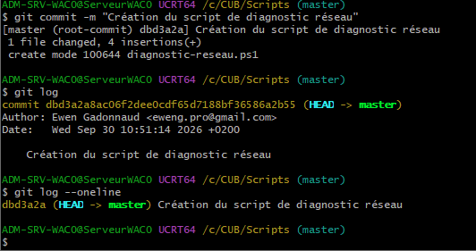

Un commit est une phase transitoire entre l'étape d'ajout d'un fichier qui sera versionné (git add) et le poussage vers le dépôt distant ou local Git de ce fichier versionné (git push). Le commit est utilisé pour informer du changement de version de notre fichier versionné, avec un commentaire.

Il est important d'utiliser un message de commit précis et explicite notamment en projet de groupe, afin d'être le plus informatif possible et de savoir d'un coup d'oeil les fonctionnalités principales ayant changées, les bugs fix etc...

## Partie 4 - Modification et suivi d'un fichier

Nous modifions le fichier "diagnostic-reseau.ps1" en ajoutant le code suivant : 

```powershell
Write-Host "Test de la pile TCP/IP"
ping 127.0.0.1
```

et nous vérifions les modifications avec les commandes "git status" et "git diff"

La commande "git diff" permets de comparer les changements entre un fichier local et un fichier qui est déjà en commit/push

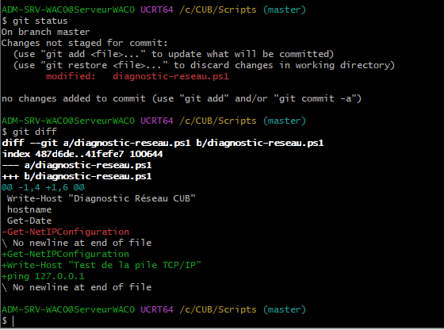

Nous enregistrons ensuite cette nouvelle version en utilisant les commandes précédemment utilisées pour faire un commit : 

```shell
git add diagnostic-réseau.ps1
git commit -m "Ajout du test TCP IP local"
git log --oneline
```

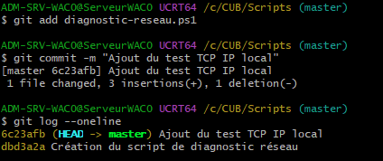

A présent, nous avons deux versions de notre projet déjà présents dans notre historique (6c23afb et dbd3a2a).

Nous réalisons une troisième modification en ajoutant les lignes suivantes : 

```powershell
Write-Host "Affichage des serveurs DNS"
Get-DnsClientServerAddress
```

Puis nous faisons le troisième commit : 

```shell
git add diganostic-reseau.ps1
git commit -m "Ajout du diagnostic DNS"
git log --oneline
```

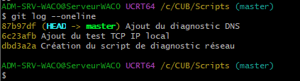

## Partie 5 - Comprendre le fonctionnement de Git

Explication des différentes commandes et de leurs influences sur le cycle de versionnement utilisé par  Git :

* git status : vérifier notre position dans le dépôt (quelle branche), l'état des fichiers indexés ou non indexés.
* git diff : comparer les changements entre un fichier local et un fichier qui est déjà sur le dépôt git local
* git add : envoyer les fichiers vers la zone d'indexation, juste avant l'envoi ver le dépôt Git local grâce au git commit
* git commit : envoyer les fichiers vers le dépôt Git local avec un message précisant les modifications apportés à ce/ces dernier(s)
* git log : vérifier les différentes versions d'un projet existant et l'auteur des différentes modifications

## Partie 6 - Annulation d'une modification non validée 

Nous ajoutons volontairement une ligne dans le fichier de script sans créer de commit afin de pouvoir essayer la commande "git restore" : 

```powershell
Write-Host "TEST INCORRECT"
```

Nous vérifions les modifications et choisissons de restaurer le fichier diagnostic-reseau.ps1 : 

```shell
git diff
git restore diagnostic-reseau.ps1
```

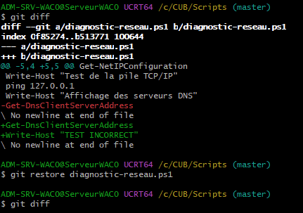

La commande git restore permets donc de récupérer la dernière version d'un fichier présente dans le dépôt git local et d'écraser la version locale.  

La modification que l'on avait faite n'a pas été enregistrée dans un commit car nous n'avons ni utilisés la commande "git add" ni "git commit".

## Partie 7 - Découverte de GitHub

Il est possible d'utiliser Git sans GitHub, GitHub permets seulement de mettre son dépôt en ligne sur les serveurs de GitHub, ce qui est utile car il peut agir comme un "hub" de sauvegardes de projet, alors qu'avec Git, tout est fait en local.

Git est un outil de versionning en local, tandis-ce que GitHub permets d'interconnecter tout les dépôts de plusieurs millions d'utilisateurs dans le monde entier.

Nous crééons alors le dépôt GitHub "CUB-Scripts-Administration" en visibilité publique.

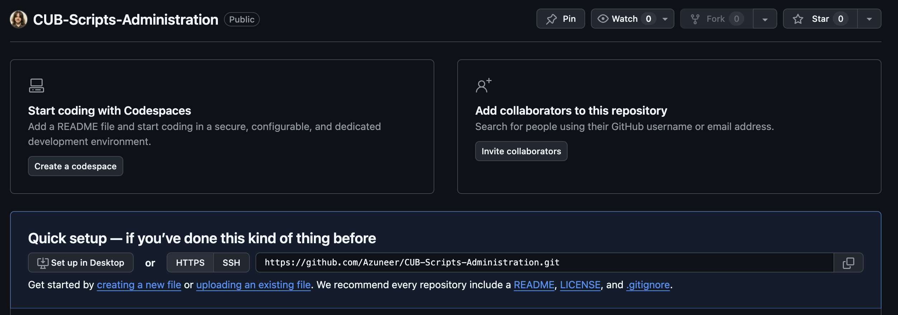

Un dépôt public est un dépôt visible et accessible à tous, il peut être cloné localement par n'importe qui. Un dépôt privé quant à lui n'est pas pas visible par tous, et n'est pas clonable par n'importe qui. 

Un administrateur système doit être vigilant avant de publier un script sur un dépôt public car il peut donner des informations sensibles en lien avec l'infrastructure de l'entreprise dans laquelle il travaille, que ce sois des mots de passes ou adresses IP locales ou autres..

Sur un dépôt GitHub il ne faut publier :

* Clés APIs
* Mots de passes
* Adresses IPs d'équipements sensibles

## Partie 8 - Relier le dépôt local au dépôt GitHub

Avec la commande suivante, nous vérifions les dépôts distants déjà configurés : 

```shell
git remote -v
```

Ici, aucun n'est configuré.

Nous associons donc notre dépôt local au dépôt GitHub créé précédemment : 

```shell
git remote add origin https://github.com/Azuneer/CUB-Scripts-Administration.git
git remote -v
```

Le nom origin représente le nom de base du dépôt distant configuré.

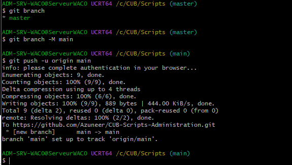

La commande permettant l'envoi de commit locaux vers GitHub est la commande "git push"

"git commit" est donc un envoi vers le dépôt local, et "git push" est un envoi vers le dépôt distant, l'utilisation de "git commit" reste impérative avant l'envoi vers le dépôt distant.

## Partie 9 - Modification et synchronisation avec GitHub

Nous ajoutons une ligne dans notre fichier de script :

```powershell
Write-Host "Test de la passerelle"
Test-NetConnection 192.168.X.126
```

et crééons un nouveau commit à l'aide des commandes suivantes : 

```shell
git status
git diff
git add diagnostic-reseau.ps1
git commit -m "Ajout du test de la passerelle"
```

Cette modification ne sera pas visible sur GitHub tant que nous n'avons pas utilisé la commande "git push".

## Partie 10 - Récupération et mise à jour d'un dépôt

"git init" permets d'initialiser un dépôt distant, mais en local. "git clone" permets de cloner littéralement un dépôt distant dans son état à jour.

Il est important de récupérer les dernières modifications avant de commencer à travailler sur un projet partagé car si un collaborateur ne fait pas de "git pull" avant de faire un "git push", il y aura un conflit de version.

## Partie 11 - Extension : travail avec des branches

Nous activons une branche dédiée aux diagnostics DNS :

```shell
git switch -c feature-diagnostic-dns
git branch

* feature-diagnostic-dns
  main
```

Git indique la branche actuellement utilisée avec une étoile avant le nom de la branche

L'intérêt de travailler dans une branche spécifique permets de limiter les conflits et de s'organiser plus facilement entre collaborateurs sur le même projet mais pour des fonctionnalités distinctes.

## Partie 12 - Modifier le projet dans une branche

Nous ajoutons une modification de notre script et nous faisons un commit dans notre nouvelle branche fraichement créée : 

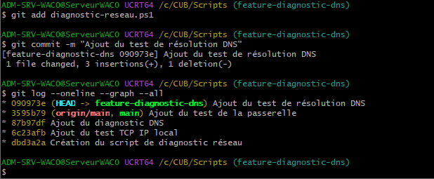

Puis nous revenons à notre branche principale "main" avec la commande "git switch main"

La modification réalisée précédemment sera seulement présente dans la branche feature-diagnostic-dns car nous avons commit sur cette branche, et non pas sur la branche main.

## Partie 13 - Fusion d'une branche

La commande merge permets de fusionner deux branches entre elles. Nous utilisons cette commande pour fusionner la branche main et la branche feature-diagnostic-dns : 

```shell
git merge feature-diagnostic-dns (main)
```

Puis, nous publions la branche mise à jour avec "git push".

## Partie 14 - Publier une branche et utiliser une Pull Request

Nous crééons la branche "feature-informations-système", ajoutons les informations nécéssaires dans notre script, puis faisons un commit et une publication de notre branche : 

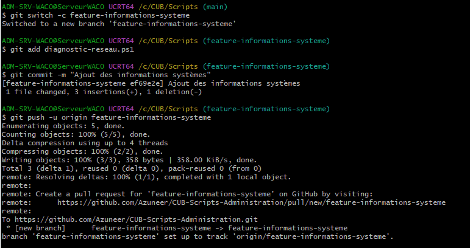

La branche apparait bien sur notre dépôt GitHub : 

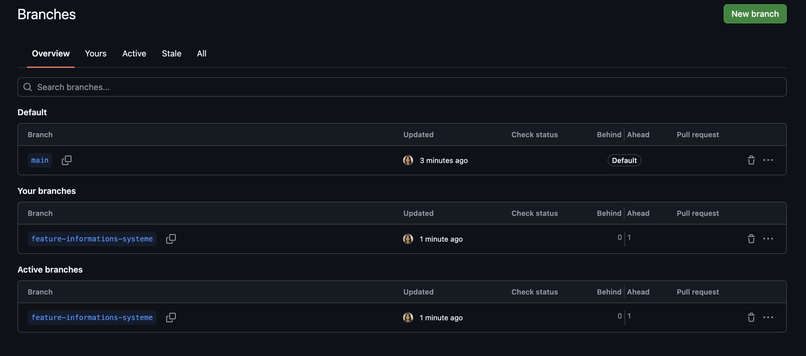

Une branche uniquement locale n'est pas présente sur GitHub et sur le dépôt distant, c'est l'état de n'importe quelle branche avant un push initial. Les branches publiées sont des branches locales qui ont été poussées vers le dépôts distant.

L'intérêt d'une pull request est de pouvoir proposer l'intégration d'une nouvelle fonctionnalité dans notre branche principale. Il est préférable de faire vérifier une modification avant son intégration pour éviter tout problème de conflit de code (pour le développement de logiciels) ou autres.

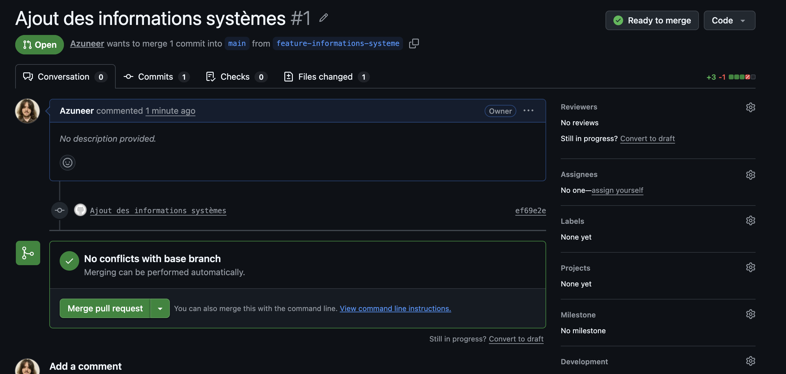
## Partie 15 - Extension : comprendre un conflit de fusion

Lors d'un conflit de fusion, Git ne peux pas déterminer automatiquement quelle modification privilégier parmis ces deux dernières, ce qui est logique car l'une n'a aucune raison valable de l'emporter sur l'autre, le choix est donc laissé à l'utilisateur lors d'un conflit. 

Celui qui doit décider du contenu à conserver est le collaborateur ayant push ses dernières modifications.

Après correction du conflit, un merge permets d'enregistrer la résolution.

## Partie 16 - Synthèse

### Rôle des commandes

| Commande | Rôle |
| --- | --- |
| `git init` | Initialise un nouveau dépôt Git local dans le répertoire courant |
| `git status` | Affiche l'état du dépôt : branche courante, fichiers suivis/modifiés/non suivis |
| `git diff` | Montre les différences entre le fichier local et la dernière version commitée |
| `git add` | Ajoute des fichiers à la zone d'indexation (pré-commit) |
| `git commit` | Enregistre les fichiers indexés dans le dépôt local avec un message descriptif |
| `git log --oneline` | Affiche l'historique des commits de façon condensée (un commit par ligne) |
| `git restore` | Annule les modifications non commitées d'un fichier (retour à la version enregistrée) |
| `git clone` | Copie un dépôt distant en local (avec tout son historique) |
| `git pull` | Récupère les modifications distantes et les fusionne dans la branche locale |
| `git push` | Envoie les commits locaux vers le dépôt distant |
| `git branch` | Liste (ou crée/supprime) les branches du dépôt |
| `git switch` | Change de branche (ou en crée une avec `-c`) |
| `git merge` | Fusionne une branche dans la branche courante |

### Git vs GitHub

**Git** est un outil de versionnement **local** : il gère l'historique, les branches et les commits sur la machine. **GitHub** est une plateforme **distant** qui héberge des dépôts et permet la collaboration : elle interconnecte les dépôts de millions d'utilisateurs dans le monde. Un **commit** est un instantané versionné avec un message ; une **branche** est une ligne de développement parallèle ; une **fusion** (merge) intègre une branche dans une autre ; une **pull request** propose cette intégration, en demandant une validation/relecture avant de l'accepter.

### Question : `git add .` puis `git commit` mais oubli du `git push`

Les autres administrateurs **ne peuvent pas voir** ce commit sur GitHub. Tant que le `git push` n'est pas exécuté, les commits restent dans le dépôt local uniquement ; GitHub n'est informé de rien.

### Question : faut-il modifier `main` directement ou créer une branche ?

Il faut créer une **branche dédiée**. Modifier directement la branche `main` rend la fonctionnalité non testée visible/cassée pour toute l'équipe dès le push. Une branche dédiée isole le travail, permet de tester puis de proposer une pull request pour intégrer proprement la fonctionnalité après validation.

## Documentation technique associée

- [PowerShell : commandes, comptes et scripts](../../documentation/adminsys/powershell.md)
- [Git et GitHub : versions, branches et collaboration](../../documentation/devops/versioning.md)
- [MkDocs Material, Obsidian et GitHub Pages](../../documentation/devops/mkdocs.md)
