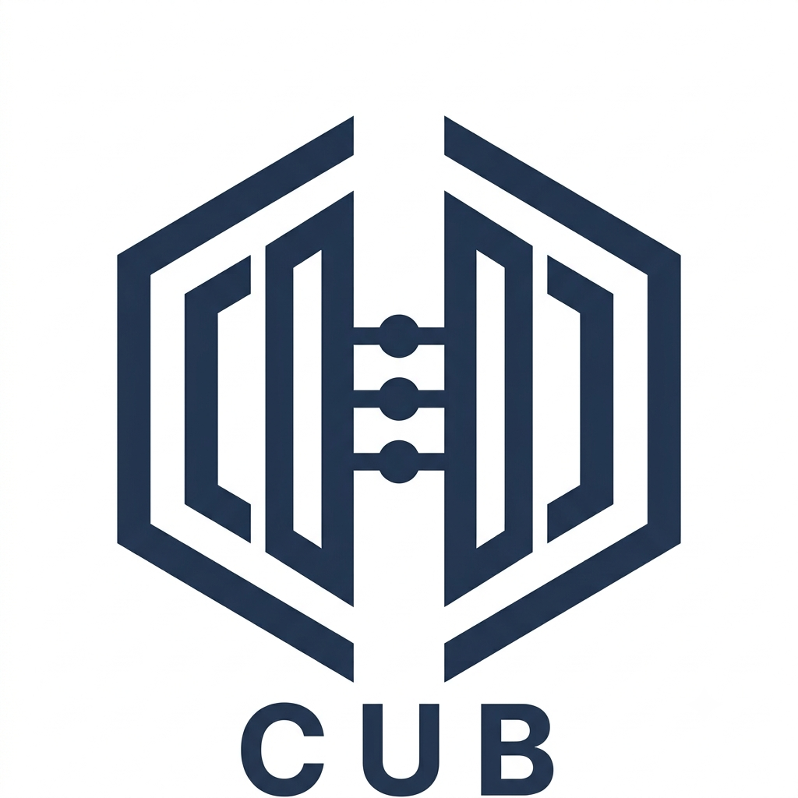

# Activité 0 : Mise en place de l'infrastructure réseau des agences de l'entreprise CUB

> :bust_in_silhouette: **Fiche rédigée par** : GADONNAUD Ewen & Rayan BOINA BOINA  
> :mortar_board: **Formation** : BTS SIO 2ème année - Option SISR  
> :school: **Établissement** : Lycée Paul-Louis Courier, Tours  
> :calendar: **Date** : Septembre 2026

---

## I. Phase d'analyse et de maquettage

### 1. Dans le schéma proposé dans le document 2, expliquer pourquoi la présence d'un réseau local unique au sein des agences pose des problèmes de sécurité puis proposer une solution adéquate

Prenons premièrement le schéma du réseau du contexte CUB :

Quand on compare le schéma avec le tableau présent dans le document 1.1, on se rend compte que plusieurs pôles d'activités sont réunis dans un seul et même réseau local (un même VLAN). Cette pratique est déconseillée et dangereuse car elle agit comme point de convergence si un attaquant arrive à accéder au réseau local de l'entreprise.

Typiquement, un virus informatique pourrait réussir à se répandre dans ce même sous-réseau alors qu'il a été installé sur un poste présent dans un pôle complètement différent.

Une solution serait alors de séparer les différents réseaux locaux en plusieurs sous-réseaux, en gardant en tête au minimum le double de la capacité d'hôtes existants par sous-réseaux lors de la séparation en plusieurs sous-réseaux.

### 2 & 3. Réaliser les schémas réseau logique et physique représentant votre nouvelle proposition + maquette

Les schémas **logique**, **physique** et de **câblage** de l'infrastructure ainsi que la maquette **Cisco Packet Tracer** sont disponibles dans l'onglet [Ressources](../../ressources/index.md) du site :

- [Schémas](../../ressources/schemas.md)
- [Maquette Packet Tracer](../../assets/schemas/cub_logique.pkt)

## II. Phase de prototypage et de mise en œuvre de la solution