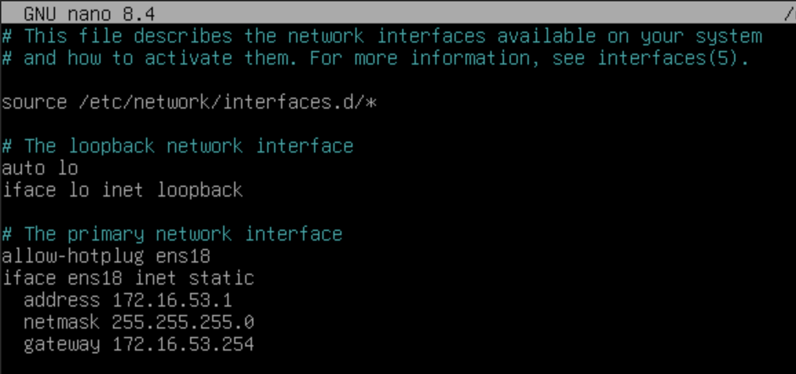
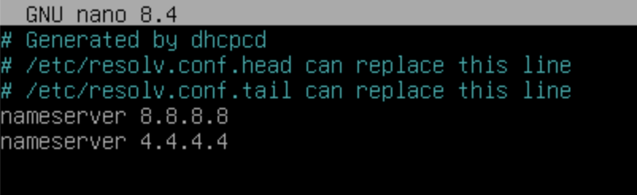
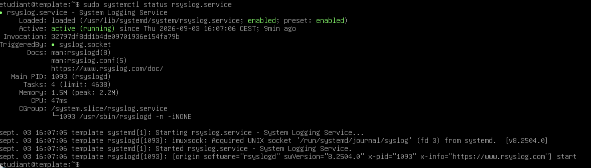
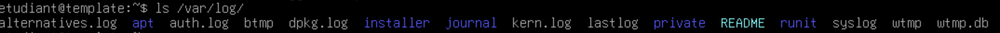
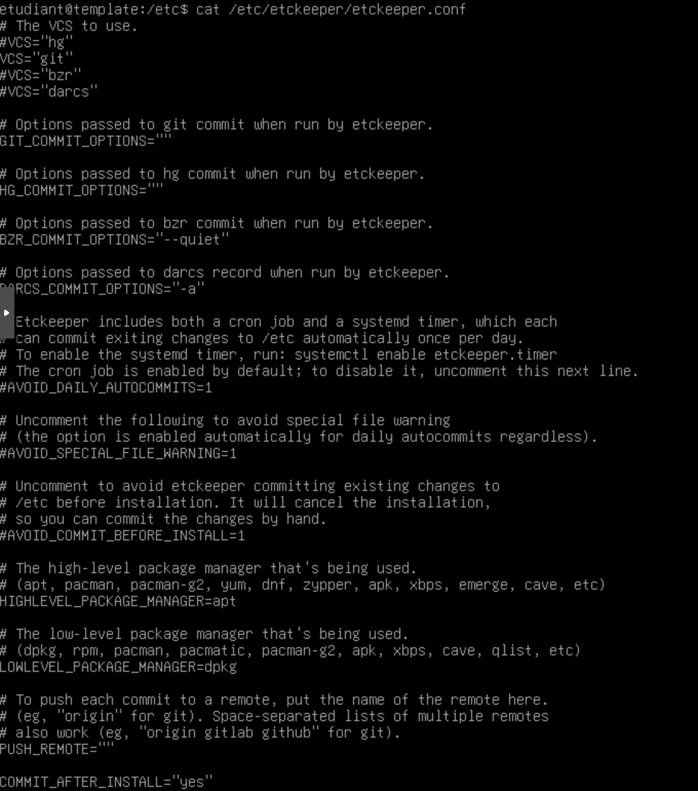
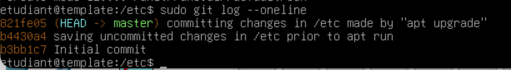
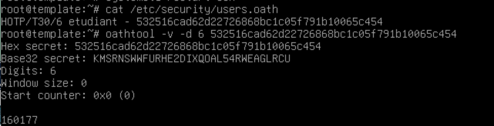

# Activité 0 : Mise en place du contexte CUB

> :bust_in_silhouette: **Fiche rédigée par** : GADONNAUD Ewen & Rayan BOINA BOINA  
> :mortar_board: **Formation** : BTS SIO 2ème année - Option SISR  
> :school: **Établissement** : Lycée Paul-Louis Courier, Tours  
> :calendar: **Date** : Septembre 2026


---

## Configuration de l'interface réseau

Avant tout, il faut configurer l'interface réseau `ens18` afin de pouvoir accéder à internet. Pour ce faire, nous éditons le fichier `/etc/network/interfaces` puis rentrons les informations ci-dessous :



Ensuite, il faut éditer le fichier `/etc/resolv.conf` afin de pointer vers un serveur DNS, ici, celui de Google :



## Installation des outils obligatoires

L'installation des outils `htop`, `tcpdump` et `tmux` est obligatoire. Pour les installer, il faut utiliser la commande suivante :

```shell
sudo apt update
sudo apt install htop tcpdump tmux
```

### Installation de rsyslog pour la gestion des logs et vérifications

Afin d'installer rsyslog sur le serveur, il faut exécuter les commandes suivantes :

```shell
sudo apt update
sudo apt install rsyslog
```

Maintenant, vérifions que le daemon tourne bien sur le serveur avec la commande suivante :

```shell
sudo systemctl status rsyslog.service
```



On remarque que le daemon tourne bien. Maintenant, vérifions que tous les logs sont bien présents et centralisés dans le répertoire `/var/log` :



### Installation et configuration de etckeeper

Afin d'installer et de configurer etckeeper, il nous faut suivre une démarche spécifique. Premièrement, l'installation du paquet avec la commande suivante :

```shell
sudo apt install etckeeper
```

Lors de l'installation, etckeeper initialise automatiquement le dépôt local dans le répertoire `/etc` et fera un commit de chaque modification, soit tous les jours automatiquement, soit à chaque mise à jour du système avec l'option `COMMIT_AFTER_INSTALL="yes"` que l'on rajoute dans le fichier de configuration de etckeeper (`/etc/etckeeper/etckeeper.conf`) :



Nous pouvons maintenant essayer de lancer une mise à jour et voir si etckeeper commit automatiquement :


Nous pouvons également regarder le journal de commit sur le dépôt avec la commande :

```shell
sudo git log --oneline
```



## Installation de qrencode et configuration du service pour l'authentification TOTP en SSH au compte etudiant

Afin de faire cette installation et cette configuration, nous nous sommes basés sur la documentation du contexte à l'URL suivante :

<https://cubdocumentation.sioplc.fr/documentation/Adminsys/Linux/02--OTP/>

Nous avons réussi à générer correctement le code hexadécimal passé en base32 avec la commande `oathtool`, qui nous a servi à générer le QR Code afin de se connecter en SSH depuis une machine externe au compte `etudiant` du serveur.

Nous précisons également que la configuration au niveau du compte `adminbastion` a été faite, car elle ne nous demande pas d'authentification OATH.



```shell
ewen@nighthack[17:08:50] [~]

-> % ssh etudiant@172.16.53.1

(etudiant@172.16.53.1) Password:
(etudiant@172.16.53.1) One-time password (OATH) for 'etudiant':

Linux template 6.12.85+deb13-amd64 #1 SMP PREEMPT_DYNAMIC Debian 6.12.85-1 (2026-04-30) x86_64

The programs included with the Debian GNU/Linux system are free software; the exact distribution terms for each program are described in the individual files in /usr/share/doc/*/copyright.

Debian GNU/Linux comes with ABSOLUTELY NO WARRANTY, to the extent permitted by applicable law.

Last login: Thu Sep 3 16:42:12 2026 from 172.16.31.253

etudiant@template:~$ exit

déconnexion
Connection to 172.16.53.1 closed.
```
