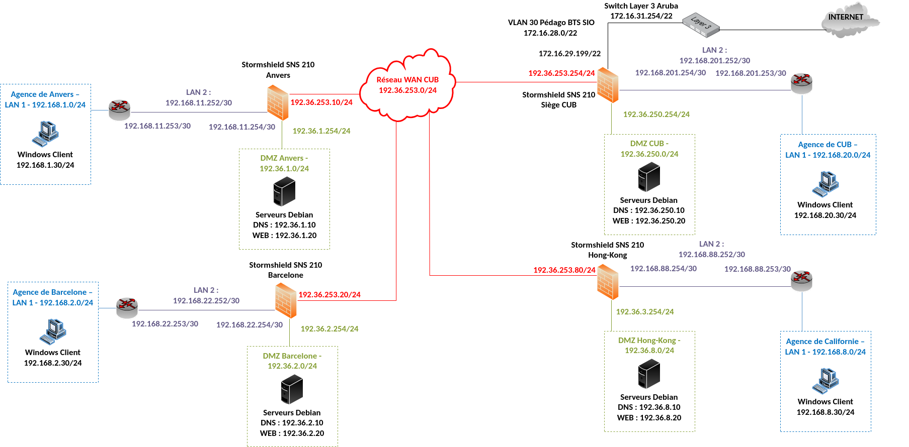

# Situation 1 : Phase d'analyse préalable

> :bust_in_silhouette: **Fiche rédigée par** : GADONNAUD Ewen  
> :mortar_board: **Formation** : BTS SIO 2ème année - Option SISR  
> :school: **Établissement** : Lycée Paul-Louis Courier, Tours  
> :calendar: **Date** : Septembre 2026

---

## 1. Expliquer ce qui a poussé le service RSSI à opter pour une solution UTM par rapport à un simple pare-feu stateful traditionnel

Le service RSSI a préféré opter pour une solution UTM par rapport à un simple pare-feu stateful traditionnel car les pare-feu UTM sont bien plus extensibles et efficaces, notamment au niveau des règles de filtrage IP et logicielles. Analysant les paquets jusqu'à la couche 7 du modèle OSI (Applicatif), les pare-feu UTM sont efficaces et assurent une couche de sécurité supplémentaire. Dans le cas de l'agence Californie de l'entreprise CUB, de sa probable extension d'effectif et de la zone DMZ présente en agence, l'utilisation d'un pare-feu UTM paraît nécessaire en prévision.

Le pare-feu UTM Stormshield propose notamment ces fonctionnalités non-négligeables que des pare-feu stateful ne proposent pas :

* Logiciel antivirus
* Logiciel anti-espions
* Protection antispam
* Pare-feu réseau
* Prévention et détection des intrusions
* Filtrage des contenus et prévention des fuites

Pour conclure, cette décision est plus que légitime dans le contexte de l'agence, de par son expansion probable et de sa DMZ.

## 2. Donner 2 arguments en faveur d'un boîtier UTM Stormshield par rapport à ceux proposés par des entreprises concurrentes telles que Palo Alto ou CheckPoint

Les deux arguments majeurs en faveur d'un boîtier UTM Stormshield comparé à d'autres solutions non souveraines sont les suivants :

* **Souveraineté** : Stormshield est une entreprise française (filiale d'Airbus Defence and Space), dont les produits sont conçus et hébergés en France, hors de portée du Cloud Act américain. Cette loi permet aux autorités US d'exiger l'accès aux données de toute entreprise américaine, même stockées hors des États-Unis. Palo Alto et Check Point restent soumis à ce type d'extraterritorialité juridique. Pour une structure traitant des données sensibles ou stratégiques, choisir un éditeur français élimine ce risque de dépendance à une juridiction étrangère.

* **Conformité réglementaire française (ANSSI)** : Les produits Stormshield bénéficient d'une qualification par l'ANSSI (Agence nationale de la sécurité des systèmes d'information), un label français exigeant qui atteste d'un niveau de sécurité vérifié par l'État. Cette qualification est un prérequis obligatoire ou fortement recommandé pour les marchés publics français, les OIV (opérateurs d'importance vitale) et certains secteurs réglementés (santé, défense, finance). Palo Alto et Check Point, non qualifiés par l'ANSSI de la même façon, sont de fait exclus ou désavantagés sur ces marchés spécifiques, même s'ils restent compétitifs ailleurs.

## 3. Dans le schéma proposé dans le contexte CUB, expliquer pourquoi la présence d'un réseau local au sein des agences pose des problèmes de sécurité. Puis proposer une solution qui prenne en compte les différents services recensés dans le document 1.1 du dossier documentaire

Prenons premièrement le schéma du réseau du contexte CUB :

Quand on compare le schéma avec le tableau présent dans le document 1.1, on se rend compte que plusieurs pôles d'activités sont réunis dans un seul et même réseau local (un même VLAN). Cette pratique est déconseillée et dangereuse car elle agit comme point de convergence si un attaquant arrive à accéder au réseau local de l'entreprise.

Typiquement, un virus informatique pourrait réussir à se répandre dans ce même sous-réseau alors qu'il a été installé sur un poste présent dans un pôle complètement différent.

Une solution serait alors de séparer les différents réseaux locaux en plusieurs sous-réseaux, en gardant en tête au minimum le double de la capacité d'hôtes existants par sous-réseaux lors de la séparation en plusieurs sous-réseaux.

## 4. Réaliser un schéma réseau logique représentant votre nouvelle proposition. Ce schéma ne concerne uniquement que le site dont vous avez la charge

Premièrement, il faut établir un nouveau plan d'adressage en adéquation avec les nouveaux changements évoqués à la question précédente :

* Séparation du sous-réseau unique en plusieurs sous-réseaux/VLANs différents
* Extension au double de la capacité d'hôtes utilisés actuellement dans chaque pôle

## Nouveau plan d'adressage — Technique VLSM

Le découpage du réseau initial `192.168.3.0/24` a été réalisé selon la technique **VLSM** (Variable Length Subnet Masking), afin d'allouer à chaque pôle d'activité un sous-réseau dimensionné en fonction de ses besoins réels, tout en respectant la contrainte du **doublement de la capacité d'hôtes actuelle** par pôle.

Cette approche évite le gaspillage d'adresses IP inhérent à un découpage en sous-réseaux de taille fixe (FLSM), en attribuant les plages les plus grandes aux pôles ayant le plus de besoins, et les plus petites aux pôles les plus restreints.

### Tableau récapitulatif des sous-réseaux

| VLAN                | Adresse réseau   | Masque          | Plage d'hôtes utilisables     | Passerelle    | Adresse de broadcast | Hôtes utilisables | Hôtes actuels (avant extension) |
| ------------------- | ---------------- | --------------- | ----------------------------- | ------------- | -------------------- | ----------------- | ------------------------------- |
| **PRODUCTION** (53) | 192.168.3.0/25   | 255.255.255.128 | 192.168.3.1 – 192.168.3.126   | 192.168.3.126 | 192.168.3.127        | 126               | ~63                             |
| **CLIENTS** (10)    | 192.168.3.128/26 | 255.255.255.192 | 192.168.3.129 – 192.168.3.190 | 192.168.3.190 | 192.168.3.191        | 62                | ~31                             |
| **ADMIN** (20)      | 192.168.3.192/28 | 255.255.255.240 | 192.168.3.193 – 192.168.3.206 | 192.168.3.206 | 192.168.3.207        | 14                | ~7                              |

> **Convention retenue** : la passerelle est placée sur la dernière adresse utilisable de chaque sous-réseau (`.126`, `.190`, `.206`), plutôt que sur la première.

### Plage restante

Le découpage des trois VLANs ci-dessus consomme `128 + 64 + 16 = 208` adresses sur les `256` disponibles dans le `/24` initial. La plage restante, `192.168.3.208` à `192.168.3.255` (soit **48 adresses**), n'est pas allouée et constitue une **réserve pour une évolution future** (ajout d'un nouveau pôle, extension supplémentaire d'un VLAN existant, etc.). Elle peut être subdivisée ultérieurement, par exemple en un `192.168.3.208/28` (16 adresses) et un `192.168.3.224/27` (32 adresses).

---

## Annexes

### Table NAT (pare-feu Stormshield)

| **IP Src**        | **Port Src** | **IP Dst**     | **Port Dst** | **IP Src (NAT)** | **Port Src (NAT)**       | **IP Dst (NAT)** | **Port Dst (NAT)** |
| ----------------- | ------------ | -------------- | ------------ | ---------------- | ------------------------ | ---------------- | ------------------ |
| 192.168.3.0/24    | Any          | Any (Internet) | Any          | 192.36.253.30    | Dynamique (éphémère)     | Any (Internet)   | Any                |
| 192.168.33.248/29 | Any          | Any            | Any          | 192.36.253.30    | Dynamique                | Any              | Any                |

### Tables de routage

#### Switch layer 3 (LAN2)

| Destination    | Masque          | Passerelle     | Interface (de sortie) | Type |
| -------------- | --------------- | -------------- | --------------------- | ---- |
| 192.168.3.0    | 255.255.255.128 | 192.168.3.126  | 192.168.3.126         | C    |
| 192.168.3.128  | 255.255.255.192 | 192.168.3.190  | 192.168.3.190         | C    |
| 192.168.3.192  | 255.255.255.240 | 192.168.3.206  | 192.168.3.206         | C    |
| 192.168.33.248 | 255.255.255.248 | 192.168.33.253 | 192.168.33.253        | C    |
| 0.0.0.0        | 0.0.0.0         | 192.168.33.254 | 192.168.33.253        | S*   |

#### Pare-feu Stormshield

| Destination    | Masque          | Passerelle     | Interface (de sortie) | Type |
| -------------- | --------------- | -------------- | --------------------- | ---- |
| 192.36.3.0     | 255.255.255.0   | 192.36.3.254   | 192.36.3.254          | C    |
| 192.168.33.248 | 255.255.255.248 | 192.168.33.254 | 192.168.33.254        | C    |
| 192.36.253.0   | 255.255.255.0   | 192.36.253.30  | 192.36.253.30         | C    |
| 192.168.3.0    | 255.255.255.0   | 192.168.33.253 | 192.168.33.254        | S    |
| 0.0.0.0        | 0.0.0.0         | 192.36.253.254 | 192.36.253.30         | S*   |
