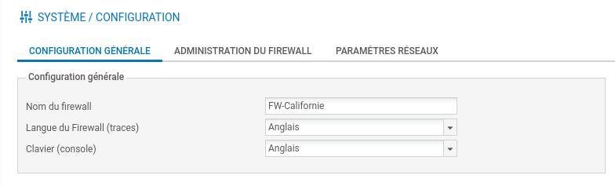
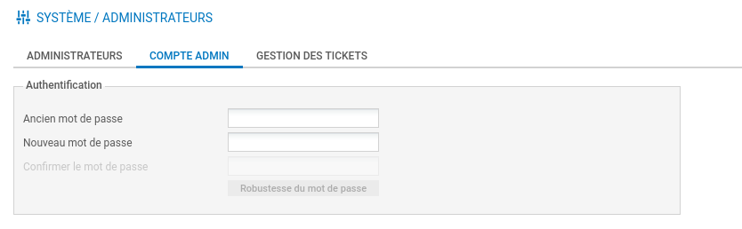
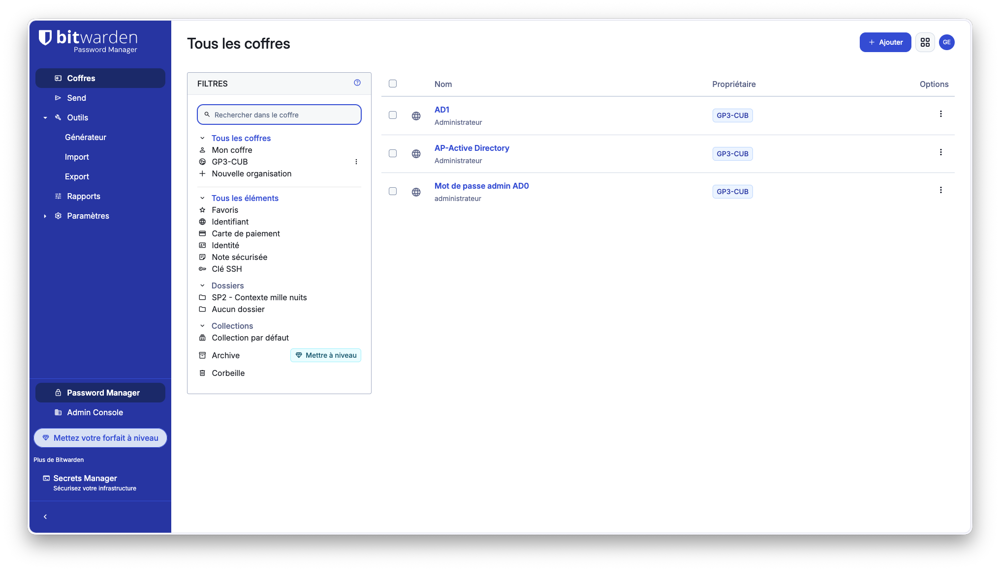
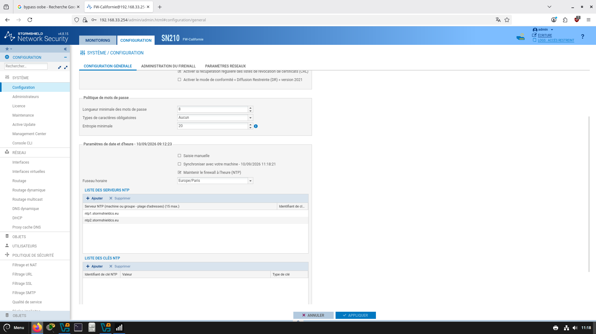
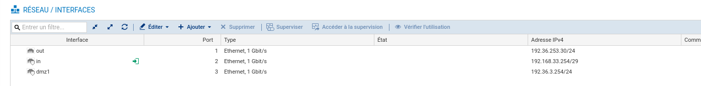
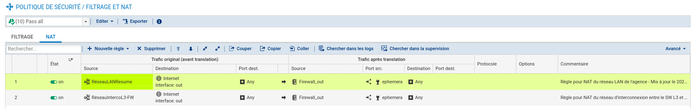
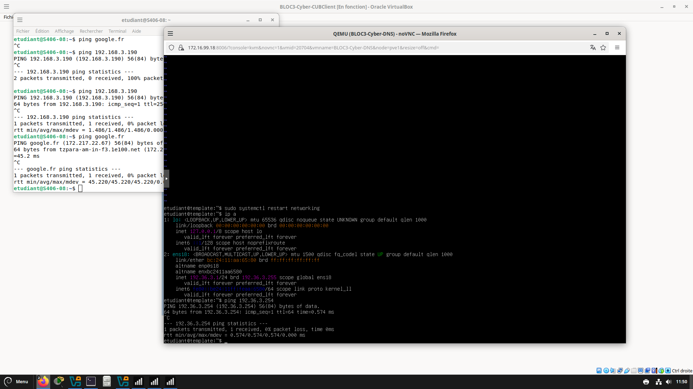
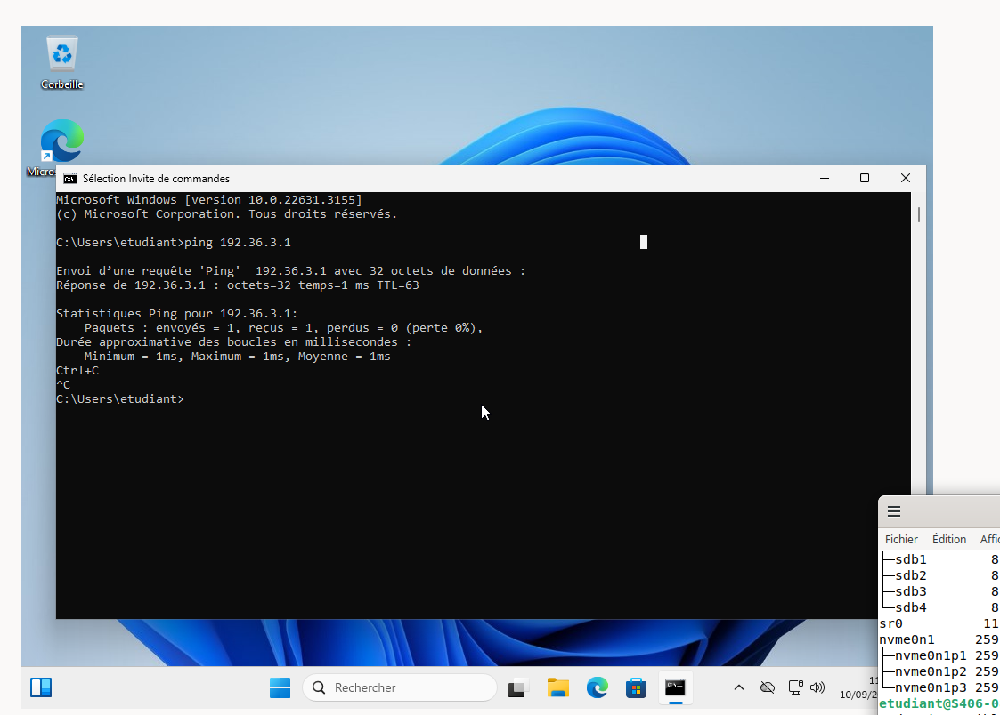

# Situation 2 : Premiers paramétrages d'un pare-feu sur un site de l'entreprise

{ width="150" }

> :bust_in_silhouette: **Fiche rédigée par** : GADONNAUD Ewen  
> :mortar_board: **Formation** : BTS SIO 2ème année - Option SISR  
> :school: **Établissement** : Lycée Paul-Louis Courier, Tours  
> :calendar: **Date** : Septembre 2026

---

## 1. Installer vos 3 VM (sans les services) et paramétrer correctement leurs cartes réseaux

Les machines Windows ont été installées dans VirtualBox sur les postes, chacune avec sa carte réseau rattachée au bon VLAN afin de correspondre à notre plan d'adressage défini en situation 1.

## 2. Renommer le pare-feu

Nous renommons le pare-feu Stormshield afin qu'il soit facilement identifiable dans l'infrastructure, en cohérence avec la convention de nommage retenue pour le contexte CUB.

## 3. Assurez-vous que la stratégie de complexité des mots de passe préconisée par l'ANSSI est effective pour le compte administrateur

Nous générons une passphrase avec le coffre-fort Bitwarden puis nous l'affectons au compte admin du pare-feu.

Une passphrase est préférée à un mot de passe classique généré aléatoirement, car elle offre une entropie suffisante tout en restant plus simple à retenir/saisir en cas de besoin manuel, tout en respectant les recommandations ANSSI (longueur importante, absence d'éléments personnels ou prévisibles).

## 4. Installer un coffre-fort numérique pour votre équipe pour partager et protéger vos mots de passe

Nous utilisons Bitwarden.

Ce coffre-fort permet à l'ensemble de l'équipe d'accéder aux identifiants nécessaires à l'administration de l'infrastructure sans les partager en clair (mail, fichier texte, etc.), et centralise la gestion des mots de passe avec un historique et un contrôle d'accès par utilisateur.

## 5. Assurez-vous que l'horodatage des évènements est bien correct. Pour cela la date et l'heure doivent correspondre au fuseau horaire Europe/Paris et doivent être synchronisés sur les serveurs NTP de la société Stormshield

Nous configurons le fuseau horaire du pare-feu sur Europe/Paris, puis renseignons les serveurs NTP officiels de Stormshield afin que l'horloge interne de l'appliance reste synchronisée avec une source fiable.

## 6. Pourquoi est-il primordial que l'ensemble des pare-feu de l'entreprise CUB soit synchronisé sur les serveurs NTP de l'entreprise Stormshield

Un horodatage cohérent entre tous les équipements de sécurité de l'entreprise est indispensable pour pouvoir corréler les événements lors d'une analyse post-incident (SIEM, investigation forensique). Si chaque pare-feu a une heure différente, il devient très difficile de reconstituer la chronologie exacte d'une attaque ou d'un incident à travers plusieurs équipements.

## 7. Configurer les interfaces réseaux de l'appliance afin que cela corresponde à ce que vous avez défini précédemment dans votre schéma de réseau logique

Nous configurons chaque interface du pare-feu (Out, In, WAN) avec les adresses IP définies dans notre schéma logique de la situation 1, à savoir l'interface WAN vers Internet, l'interface LAN vers nos VLANs internes, et l'interface DMZ vers nos serveurs publics.

Conformément au plan d'adressage défini en situation 1, nous configurons les interfaces :

## 8. Dans le menu Filtrage et NAT, appliquer la politique de filtrage (10) Pass All afin d'éviter des blocages ou erreurs liés à cette dernière

Cette politique temporaire permet de laisser passer l'ensemble des flux durant la phase de configuration et de test, afin de ne pas confondre un problème de connectivité réseau avec un blocage lié à une règle de filtrage trop restrictive. Elle sera resserrée dans une situation ultérieure une fois l'infrastructure validée.

Le NAT est paramétré sur la règle Pass All, en accord avec notre [table NAT](../../ressources/schemas.md) :

| **IP Src**        | **Port Src** | **IP Dst**     | **Port Dst** | **IP Src (NAT)** | **Port Src (NAT)**   | **IP Dst (NAT)** | **Port Dst (NAT)** |
| ----------------- | ------------ | -------------- | ------------ | ---------------- | -------------------- | ---------------- | ------------------ |
| 192.168.3.0/24    | Any          | Any (Internet) | Any          | 192.36.253.30    | Dynamique (éphémère) | Any (Internet)   | Any                |
| 192.168.33.248/29 | Any          | Any            | Any          | 192.36.253.30    | Dynamique            | Any              | Any                |

## 9. Réaliser une recette de la situation à l'aide de tests de connectivité entre le poste client et les serveurs présents en DMZ

Nous avons positionné un serveur Debian dans le VLAN DMZ (ProjetS sur Proxmox) et configuré comme tel au niveau des adresses IP :

* IP : `192.36.3.1/24`
* Passerelle : `192.36.3.254`

Puis nous contactons le serveur avec notre machine Windows sous VirtualBox positionnée dans le VLAN CLIENT, et une autre machine présente dans le VLAN ADMINISTRATION.

Nous remarquons que nous arrivons à contacter le serveur présent dans la DMZ depuis les deux VLANs testés, ce qui valide la connectivité de bout en bout avec la politique Pass All actuellement en place.