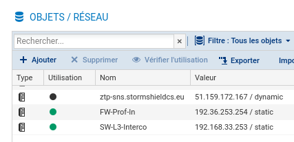
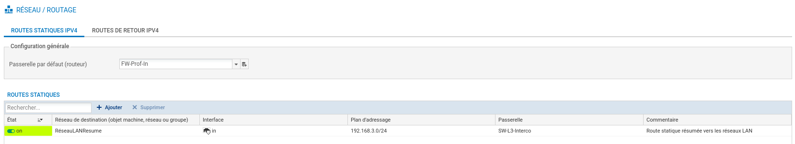
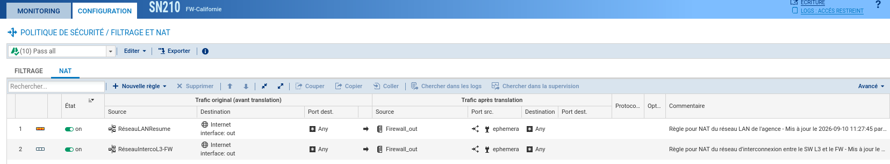
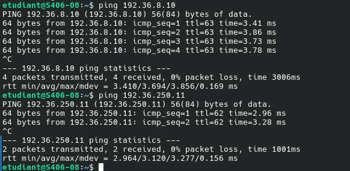
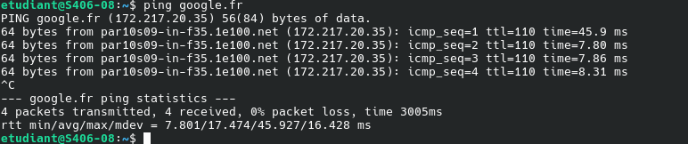
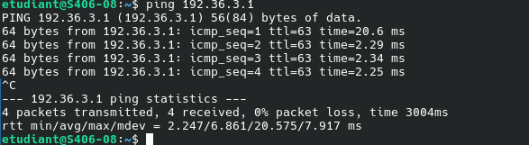
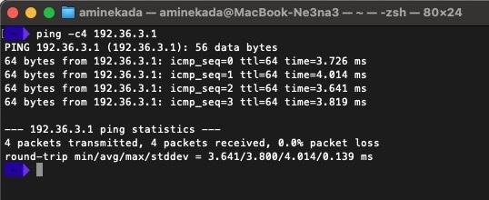

# Situation 3 : Routage et NAT

{ width="150" }

> :bust_in_silhouette: **Fiche rédigée par** : GADONNAUD Ewen  
> :mortar_board: **Formation** : BTS SIO 2ème année - Option SISR  
> :school: **Établissement** : Lycée Paul-Louis Courier, Tours  
> :calendar: **Date** : Septembre 2026

---

## 1. Rédiger la table de routage du pare-feu Stormshield de votre agence

La table de routage du pare-feu Stormshield de notre agence, reprise également dans la section [Ressources > Schémas](../../ressources/schemas.md), est la suivante :

| Destination    | Masque          | Passerelle     | Interface (de sortie) | Type |
| -------------- | --------------- | -------------- | --------------------- | ---- |
| 192.36.3.0     | 255.255.255.0   | 192.36.3.254   | 192.36.3.254          | C    |
| 192.168.33.248 | 255.255.255.248 | 192.168.33.254 | 192.168.33.254        | C    |
| 192.36.253.0   | 255.255.255.0   | 192.36.253.30  | 192.36.253.30         | C    |
| 192.168.3.0    | 255.255.255.0   | 192.168.33.253 | 192.168.33.254        | S    |
| 0.0.0.0        | 0.0.0.0         | 192.36.253.254 | 192.36.253.30         | S*   |

- **Type C** : route connectée (interface directement rattachée au sous-réseau)
- **Type S** : route statuelle
- **Type S*** : route par défaut

La route par défaut (`0.0.0.0/0`) redirige tout le trafic destiné à Internet vers le pare-feu professionnel (`192.36.253.254`) via la sortie WAN (`192.36.253.30`).

## 2. Déterminer quelle adresse IP du WAN doit servir de passerelle pour aller sur internet ? Puis créer un objet réseau afin que cette adresse IP soit représentée dans l'interface d'administration

L'interface WAN (OUT) du pare-feu de notre agence utilise l'adresse `192.36.253.30/24`. La passerelle pour accéder à Internet est l'adresse du pare-feu professionnel : `192.36.253.254`.

Nous créons un objet réseau dans l'interface d'administration Stormshield (onglet **Objets > Réseau**) afin de pouvoir référencer cette adresse de façon exploitable dans les règles de routage et de filtrage.

## 3. Utiliser cet objet afin de pouvoir implémenter la table de routage sur votre pare-feu

L'objet créé précédemment est utilisé comme passerelle de la route par défaut pour notre pare-feu : tous les paquets destinés à Internet sont envoyés vers le pare-feu professionnel (`192.36.253.254`) via notre interface WAN.

Nous nous rendons dans l'onglet **Réseau > Routage** pour configurer la route par défaut et la route résumée pour le réseau privé LAN.

Un objet « RéseauLANResume » a été créé au préalable afin de cibler l'ensemble de notre réseau interne (`192.168.3.0/24`).

## 4. Proposer et paramétrer une solution technique permettant aux adresses IP privées de votre site de pouvoir communiquer sur le réseau WAN public et Internet

La solution retenue est le **NAT avec surcharge** (MASQUERADING), qui permet à toutes les adresses privées du LAN d'êtrenatteindre depuis Internet en se cachant derrière l'adresse publique de notre interface WAN.

Voici le tableau récapitulatif des règles de NAT à instaurer sur le pare-feu (reprises également dans les annexes de la [Situation 1](situation1.md)) :

| **IP Src**        | **Port Src** | **IP Dst**     | **Port Dst** | **IP Src (NAT)** | **Port Src (NAT)**   | **IP Dst (NAT)** | **Port Dst (NAT)** |
| ----------------- | ------------ | -------------- | ------------ | ---------------- | -------------------- | ---------------- | ------------------ |
| 192.168.3.0/24    | Any          | Any (Internet) | Any          | 192.36.253.30    | Dynamique (éphémère) | Any (Internet)   | Any                |
| 192.168.33.248/29 | Any          | Any            | Any          | 192.36.253.30    | Dynamique            | Any              | Any                |

Le paramétrage s'effectue dans l'onglet **Politique de sécurité > Filtrage et NAT** :

## 5. Peut-on joindre le pare-feu général CUB puis les serveurs présents dans sa DMZ ? Proposer une analyse des résultats obtenus

Nous réalisons un test de ping depuis un poste du VLAN 10 (Clients) vers deux serveurs :

* **DMZ Hong Kong** (pare-feu professionnel) : `192.36.8.10`
* **DMZ Siège** (pare-feu du siège) : `192.36.250.11`

Les deux pings aboutissent. **Analyse** :

Les paquets émis depuis notre LAN sont NATés (transformés avec l'adresse source `192.36.253.30`) lors du passage par notre pare-feu Stormshield. C'est cette adresse publique que voient les serveurs DMZ en réponse. Comme ces serveurs sont directement joignables depuis Internet, la communication fonctionne grâce à la surcharge NAT configurée en question 4.

## 6. Proposer et paramétrer une solution technique permettant aux services WEB et FTP de votre DMZ d'être interrogés par le réseau WAN

Afin que les services hébergés dans notre DMZ soient joignables depuis Internet, il ne faut pas appliquer de NAT sur le trafic entrant vers la DMZ. Chaque serveur public doit disposer d'une **adresse publique dédiée** (ou une traduction NAT statique dans le cas d'un routage avec adresse privée, mais ici les serveurs DMZ ont des adresses publiques).

Le pare-feu laisse ainsi entrer les flux WAN vers la DMZ sans remapping d'adresse, en s'appuyant sur la table de routage et les règles de filtrage pour ne autoriser que les services exposés (HTTP, HTTPS, FTP) tout en bloquant le reste.

## 7. Réaliser une recette permettant de valider les objectifs de cette situation

La recette de validation suit quatre étapes :

### Étape 1 — Connectivité Internet

La connexion de l'agence à Internet fonctionne. Nous vérifions en accédant à Google depuis un poste du VLAN Client :

### Étape 2 — Communication inter-réseau (LAN ↔ DMZ)

Nous vérifions que la communication entre le réseau interne et les serveurs DMZ fonctionne, en pingant un serveur situé dans la DMZ depuis un poste du LAN :

### Étape 3 — Atteignabilité de la DMZ depuis l'extérieur

Nous demandons à une agence voisine (VLAN Administration, pare-feu professionnel) de ping notre serveur DMZ à l'adresse `192.36.3.1` :

Le ping externe aboutit, confirmant que la DMZ est bien accessible depuis le réseau WAN public.

### Étape 4 — Résumé des résultats

| Objectif | Résultat |
| --- | --- |
| Connectivité Internet depuis le LAN | ✅ |
| Communication LAN ↔ DMZ | ✅ |
| DMZ accessible depuis le WAN | ✅ |
| Filtrage et NAT cohérents avec la table | ✅ |