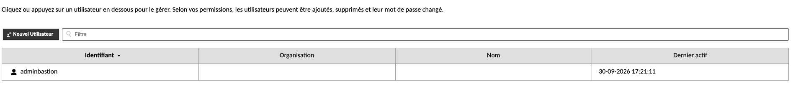
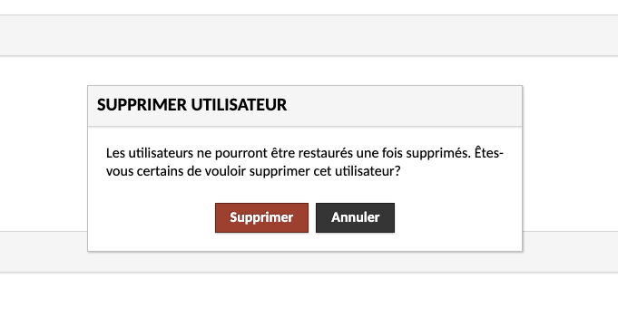
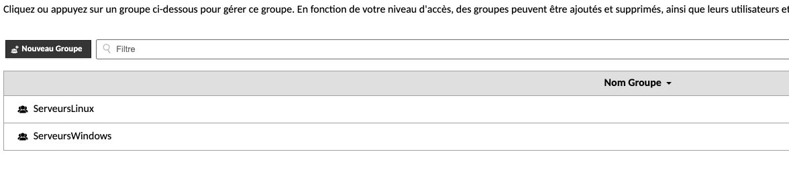
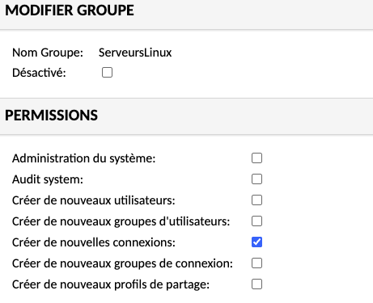
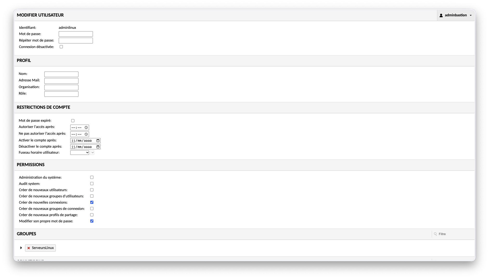

# Situation 4 : Déploiement et sécurisation d'un bastion

{ width="150" }

> :bust_in_silhouette: Fiche rédigée par : GADONNAUD Ewen
> :mortar_board: Formation : BTS SIO 2ème année - Option SISR
> :school: Établissement : Lycée Paul-Louis Courier, Tours
> :calendar: Date : Septembre 2026

---

# Activité 1 - Réflexions préalables à l'installation d'un bastion

## Partie 1 : Bastion et rupture protocolaire

### 1. Le bastion met-il en œuvre une rupture protocolaire complète entre l'utilisateur et les ressources ?

Le bastion permet de mettre en place une rupture protocolaire en faisant un effet de rebond vers les différents protocoles. En effet, un administrateur se connecte sur le bastion, puis il est redirigé avec le bon protocole vers les serveurs ou équipements choisis.  
### 2. Les sessions utilisateur et les sessions vers les cibles sont-elles distinctes et indépendantes ? 

Une session utilisateur et une session vers les cibles sont distinctes et indépendantes de par leurs accréditations et droits d'accès. Par exemple, un utilisateur auditeur (session utilisateur) n'a accès qu'a la journalisation et pas à la session vers les cibles, qui pourrait lui être un utilisateur administrateur.
### 3. Est-il impossible techniquement d'établir une connexion directe entre l'utilisateur et la ressource

Il est techniquement possible de rendre impossible une connexion directe entre l'utilisateur et la ressource grâce à des règles de filtrages renforcées au niveau des équipements d'interconnexion. 
### 4. Le bastion est-il l'unique point d'entrée pour les accès d'administration

Le bastion n'est pas l'unique point d'entrée pour les accès d'administration, il devrait l'être dans un réseau dit sécurisé et segmenté car il agit en tant que point central d'interconnexion protocolaire entre les différents serveurs, mais, une connexion directe peut être possible si le réseau est mal configuré. 
## Partie 2  : Bastion et son positionnement dans l'architecture réseau

### 5. Le bastion est-il isolé dans une zone réseau spécifique ?

Selon les recommandations de l'ANSSI, le bastion se doit d'être isolé dans une zone réseau spécifique propre à lui même, avec un VLAN attribué spécifiquement au bastion. 
### 6. Les flux réseau entrants et sortants du bastion sont-ils documentés, contrôlés et limités aux protocoles strictement nécessaires ? 

Les flux réseau entrants et sortants du bastion peuvent être documentés et les protocoles utilisés pour s'y connecter limités au strict nécessaires, par exemple le protocole HTTPS seulement (dans le cas de Apache Guacamole) grâce à un équipement d'interconnexion .

Mais le bastion en tant que tel ne peut pas faire de filtrage protocolaire. 
### 7. Le bastion est-il intégré dans une architecture globale qui assure la traçabilité et la supervision des accès d'administration ?

Il faut et il est recommandé qu'il soit intégré dans une architecture globale qui assure une certaine cohérence de traçabilité et de supervision générale des accès d'administration.
### 8. Des mesures de continuité et de résilience sont-elles prévues pour garantir les accès critiques en cas d'indisponibilité du bastion ? 

Des mesures de continuité et de résilience doivent être prévues pour garantir les accès critiques en cas d'indisponibilité du bastion, notamment par la présence d'un WAC. Le cas inverse, le bastion constituerais un SPOF (Single Point Of Failure) et son indisponibilité entrainerait la perte d'accès aux serveurs.

# Activité 2 - Installation du bastion, gestion des utilisateurs et des connexions SSH / RDP

## Partie 1 : Modification de l'infrastructure réseau et installation du bastion

### 1. Proposer une procédure de mise en oeuvre de la nouvelle architecture intégrant des règles de filtrage (prévoir la possibilité de positionner 3 bastions)

On ajoute à la suite, un bloc vlan 51 BASTION en 192.168.3.208/29, notre Bastion0 est en 192.168.3.209/29 et le bastion1 est en 192.168.3.210/29

Notre passerelle sera la dernière adresse réseau en 192.168.3.214/29

### 2. Mettre en oeuvre l'évolution de l'infrastructure en suivant la fiche 2 BASTION_Guacamole - Installation.

Nous utilisons une machine debian 12 afin d'installer Apache Guacamole

Il nous suffis de suivre la procédure d'installation présente sur Elea.

Nous faisons une commande scp pour envoyer le fichier de script d'installation tomcat9 sur le serveur bastion0 avec la commande suivante : 

```shell
scp deploiement_tomcat9.sh etudiant@192.168.3.209:/tmp
```

et nous le lançons comme ceci :

```shell
sudo chmod +x deploiement_tomcat9.sh
sudo ./deploiement_tomcat9.sh
```

Pour se connecter, nous utilisons les identifiants de base suivants : 

ID : guacadmin
MDP : <mot de passe>

> Apache Guacamole est accessible à l'adresse https://192.168.3.209:8443/guacamole

## Partie 2 : Gestion des utilisateurs

Nous créons donc l'utilisateur adminbastion avec un mot de passe généré qui respecte les recommandations de l'ANSSI et nous supprimons l'utilisateur par défaut. 

L'utilisateur adminbastion possède tout les droits, sauf celui de l'auditeur.




L'ANSSI recommande de ne pas attribuer les droits audit système à l'administrateur car il pourrait falsifier les journaux et logs d'activités en cas de compromission.





## Partie 3 : Gestion des sessions SSH et RDP

## Documentation technique associée

- [Debian : réseau, paquets et services systemd](../../documentation/adminsys/linux.md)
- [SSH, SCP et RDP](../../documentation/adminsys/ssh-rdp.md)
- [RAID, sauvegardes et continuité](../../documentation/adminsys/raid-sauvegarde.md)
- [IPv4, CIDR et calcul VLSM](../../documentation/reseau/adressage-vlsm.md)
- [VLAN, trunks et routage inter-VLAN](../../documentation/reseau/vlan-routage.md)
- [Bastion Apache Guacamole : architecture et accès](../../documentation/cybersecurite/guacamole.md)
- [Authentification : mots de passe, Bitwarden et TOTP](../../documentation/cybersecurite/authentification.md)
- [HTTPS, TLS et certificats](../../documentation/cybersecurite/tls.md)
